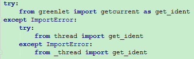
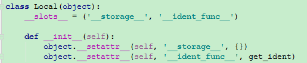
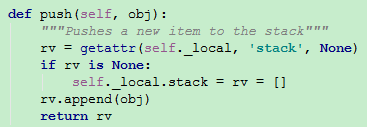
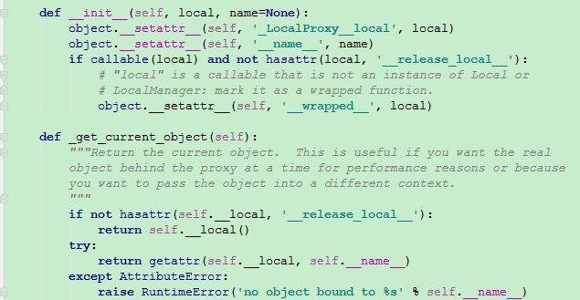
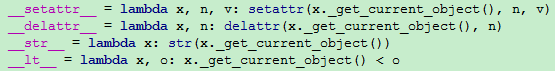
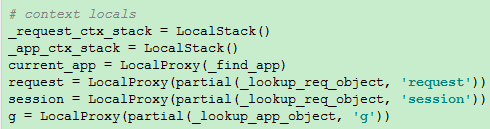

#Flask中的上下文

Flask 背后的设计理念之一就是，代码在执行时会处于两种不同的“状态”（states）
第一种是未处理请求的时候：
  * 可以安全地修改应用对象
  * 通过一个指向应用对象的引用来修改它。（不会有某个神奇的代理变量指向你刚创建的或者正在修改的应用对象的）

第二种是处理请求的时候：
  * 上下文的本地对象`flask.request`指向当前的请求
  * 在任何时间里使用任何代码与这些对象通信


####local.Local类
从面向对象设计的角度看，对象是保存"状态"的地方，Flask中这些保存"状态"的对象都在`local`模块

<div align=center>



</div>

`Local`类实现了一种字典的数据结构。具有两个属性：`__storage__`和`__ident_func__`
  * `__storage__`：依据当前的线程/协程ID为键，来保存"状态"的对象的字典。
  * `__ident_func__`：返回一个整数，这个整数可以确定当前线程或者协程的唯一ID。

`Local`类通过以线程/协程的 ID 来保存多份状态字典。实现了“状态”对线程/协程隔离，每个线程/协程对`Local`对象的修改都不会影响其他线程/协程。

```
Local：{
	ident1:{name:value},
    ident2:{name:value},
}
```


####local.LocalStack类
`LocalStack`本质上也是对`Local`的一种封装，让所有"状态"对象都保存在键`stack`的栈中。同时也实现了`push`、`pop`、`top`等方法。

<div align=center>


</div>

`LocalStack`通过这种栈数据结构，使得栈顶永远是当前的“状态”。

```
LocalStack._local{
	ID1:{
    "stack":[],
    },
	ID2:{
    "stack":[],
    },
}
```

####local.LocalProxy类
一个典型的代理模式的实现.通过重载各种黑魔法函数（例如`__or__` `__add__`...），保证在对其的各种操作都能转发到被代理的对象。
  * 构造的时候接受一个可被调用的参数，这个参数的返回值应该是一个`Local`/`LocalStack`对象。
  * 构造时候接受一个参数，参数应该是一个`Local`对象。返回它`name`键的值。

<div align=center>


</div>


####存储状态的对象
flask中存储状态的对象在`globals`模块中，全局对象`request_ctx_stack`和`_app_ctx_stack`分别实例化了`LocalStack`类。
Flask 设计的支柱之一是你可以在一个 Python 进程中拥有多个应用。所以要使用`_app_ctx_stack`来区分不同的应用。
实际的web环境中，每个请求会以单独的一个线程/协程存在。所以要使用`request_ctx_stack`来区分不同的请求。

<div align=center>


</div>
</div>


