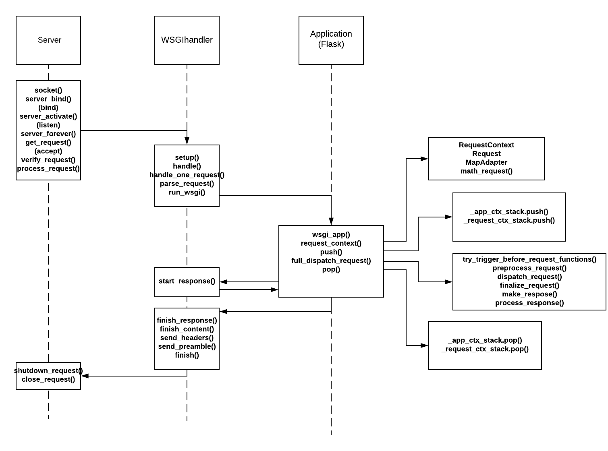

#Flask

Flask是当下流行的Web框架，它是用Python实现的。Flask显著的特点是：它是一个“微”框架。”微”意味着Flask旨在保持核心的简单，但同时又易于扩展。Flask的这些特性，使得它在Web开发方面变得非常流行。

####基础知识
使用Flask框架开发的属于Web应用。由于Python使用WSGI网关，所以这个应用也可以叫WSGI应用。对于WSGI应用，要求实现一个可调用对象`app(environ, start_response)`。WSGI服务器中会定义`start_response()`函数并且调用WSGI应用。

####flask的流程
<div>

</div>

####flask的钩子

<div>

</div>


####简单的flask服务器程序

```
#!/usr/bin/python
# -*- coding: utf-8 -*-

from flask import Flask

app = Flask(__name__)

@app.route('/')
def index():
    return '<h1>Hello World!</h1>'

if __name__ == '__main__':
    app.run()

```