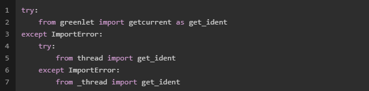
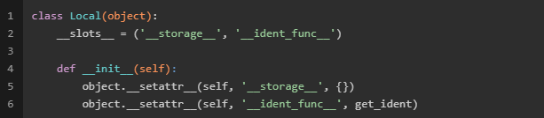

#Flask中的数据

Flask 背后的设计理念之一就是，代码在执行时会处于两种不同的“状态”（states）
第一种是未处理请求的时候：
  * 可以安全地修改应用对象
  * 通过一个指向应用对象的引用来修改它。（不会有某个神奇的代理变量指向你刚创建的或者正在修改的应用对象的）

第二种是处理请求的时候：
  * 上下文的本地对象`flask.request`指向当前的请求
  * 在任何时间里使用任何代码与这些对象通信


##存储状态的类
从面向对象设计的角度看，对象是保存"状态"的地方，Flask中这些保存"状态"的对象都在`local`模块

####local.Local类
`Local`类实现了一种字典的数据结构。
<div align=center>


</div>

`Local`类具有两个属性：`__storage__`和`__ident_func__`
  * `__storage__`：依据当前的线程/协程ID为键，来保存"状态"的对象的字典。
  * `__ident_func__`：返回一个整数，这个整数可以确定当前线程或者协程的唯一ID。


```
Local：{
	ID1:{}
    ID2:{}
}
```

####local.LocalStack类
`LocalStack`类实现了一种栈数据结构。实现了实现了`push`、`pop`、`top`等方法。本质上也是对`Local`的一种封装，让所有"状态"对象都保存在一个"stack"为键的栈中。

```
LocalStack._local{
	ID1:{
    "stack":[],
    },
	ID2:{
    "stack":[],
    },
}
```

####local.LocalProxy类
一个典型的代理模式的实现，构造的时候接受一个可被调用的参数，这个参数的返回值应该是一个`Local`/`LocalStack`对象。`LocalProxy`通过重载各种黑魔法函数（例如`__or__` `__add__`...），保证在对齐的各种操作都能转发到被代理的对象。

##存储状态的对象
flask中存储状态的对象在`globals`模块中，全局对象`request_ctx_stack`和`_app_ctx_stack`分别实例化了`LocalStack`。
####`_app_ctx_stack`

####`request_ctx_stack`
>Flask 设计的支柱之一是你可以在一个 Python 进程中拥有多个应用。

  * `request_ctx_stack`：请求上下文的对象，
  * `_app_ctx_stack`：应用上下文的对象，

http://fanchunke.me/Flask/Werkzeug%E5%BA%93%E2%80%94%E2%80%94routing%E6%A8%A1%E5%9D%97/