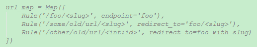

#URL

和URL链接有关的类大致由以下三个：
  * `Map`:存储所有的URL规则。
  * `Rule`:代表一个URL模式。
  * `MapAdapter`类执行URL匹配的具体工作并构建基本的运行信息。

####Map类
`Map`中存储了各种各样`Rule`。

`Map`实例可以通过后续的调用和给定的`URL`进行匹配。主要由以下属性：
  * `_rules`：当前规则中所有的模式列表。
  * `_rules_by_endpoint`：视图函数对应的模式列表。