#Jinja2

Jinja2 是一个现代的，设计者友好的，仿照 Django 模板的 Python 模板语言。 它速度快，被广泛使用，并且提供了可选的沙箱模板执行环境保证安全。模板在Python的web开发中广泛使用，它能够有效的将业务逻辑和页面逻辑分开，使代码可读性增强、并且更加容易理解和维护。

##模版
模板仅仅是文本文件。它可以生成任何基于文本的格式（HTML、XML、CSV、LaTex 等等）。 它并没有特定的扩展名， .html 或 .xml 都是可以的。模板包含**变量**或**表达式**，这两者在模板求值的时候会被替换为值。

表达式有以下几种
  * 控制语句
  * 过滤器
  * 测试器
  * 函数
  * 运算符

同时Flask还开放了以下几种方法和装饰器来自定义`Jinja2`功能

|函数|装饰器|作用
|-|-|
|add_template_filter|  template_filter |自定义过滤器
|add_template_test|  template_test| 自定义测试器
|add_template_global|  template_global| 自定义全局函数
||context_processor|自定义上下文

####分隔符
  * ``：执行各种语句
  * `{{ ... }}`：把表达式的结果打印到模板上
  * `{# ... #}`：注释

####控制语句
`if`语句的执行顺序``、``、``、``，必须要由``结尾。
`for`语句的执行顺序``、``、````、``，必须由``结尾。当`for`遍历的未空时，就进入`else`语句。`for`语句中还可以访问循环的内置变量：

变量|内容
-|-
loop.index|循环迭代计数（从1开始）
loop.index0|循环迭代计数（从0开始）
loop.revindex|循环迭代倒序计数（从len开始，到1结束）
loop.revindex0|循环迭代倒序计数（从len-1开始，到0结束）
loop.first|是否为循环的第一个元素
loop.last|是否为循环的最后一个元素
loop.length|循环序列中元素的个数
loop.cycle|	在给定的序列中轮循，如上例在”odd”和”even”两个值间轮循
loop.depth|当前循环在递归中的层级（从1开始）
loop.depth0|当前循环在递归中的层级（从0开始）


####过滤器
变量可以通过过滤器修改。过滤器与变量用管道符号`|`分割，并且也 可以用圆括号传递可选参数。多个过滤器可以链式调用，前一个过滤器的输出会被作为 后一个过滤器的输入。jinja2中默认的过滤器在模块和过滤器处理方法`jinja2.filters`模块中，也可以在[官方文档](http://docs.jinkan.org/docs/jinja2/templates.html#builtin-filters)中查看。下面列举一些常用的：


|过滤器名称|说明|
|-|-|
|safe|  渲染时值不转义 |
|capitialize|  把值的首字母转换成大写，其他子母转换为小写|
|lower|  把值转换成小写形式|
|upper|  把值转换成大写形式|
|title|把值中每个单词的首字母都转换成大写|
|trim|把值的首尾空格去掉|
|striptags|渲染之前把值中所有的HTML标签都删掉|
|join |拼接多个值为字符串|
|replace|替换字符串的值|
|round|默认对数字进行四舍五入，也可以用参数进行控制|
|int |把值转换成整型|


除了`jinja2`中默认的过滤器之外，flask也会额外添加一个`tojson`过滤器，它可以把对象转换为 `JSON` 格式。
<div align=center>
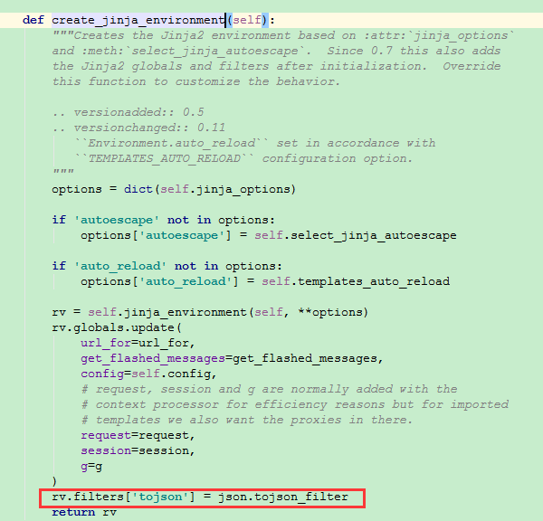
</div>

同时我们可以使用装饰器`template_filter`或者函数`add_template_filter`增加自定义过滤器。本质上是封装了`Jinja2`环境变量的操作。

<div align=center>
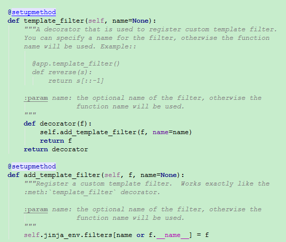
</div>


####测试器

测试可以用于对照普通表达式测试一个变量。 要测试一个变量或表达式，你要在变量后加上一个`is` 以及测试的名称。例如，要得出 一个值是否定义过，你可以用 `name is defined` ，这会根据 `name` 是否定义返回 `true` 或 `false` 。

测试也可以接受参数。如果测试只接受一个参数，你可以省去括号来分组它们。例如， 下面的两个表达式做同样的事情:
```


```

显然测试器本质上也是一个函数，它的第一个参数就是待测试的变量，在模板中使用时可以省略去。如果它有第二个参数，模板中就必须传进去。测试器函数返回的必须是一个布尔值，这样才可以用来给`if`语句作判断。默认的测试器在`Jinja2.test`模块中可以查看，也可以在[官方文档](http://docs.jinkan.org/docs/jinja2/templates.html#builtin-tests)上查找，常见的测试器有

|测试器名称|说明|
|-|-|
|defined|  是否被定义 |
|upper|  是否都是大写|
|none|  是否为空|
|string|  是否为字符串|
|an even/odd number|是否为奇/偶数|
|iterable|是否可迭代|
|mapping|是否为字典|


同样的，我们可以使用装饰器`template_test`或者函数`add_template_test`增加自定义测试器。

<div align=center>
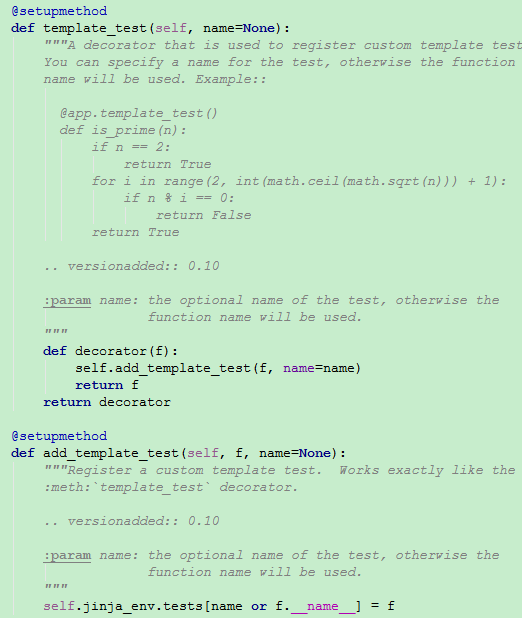
</div>


####上下文

模版的上下文对象是在`jinja2.runtime`模块里面的`Context`类。
<div align=center>

</div>

在附录中的`resolve()`函数就是获取`Context`类中的构造函数的`parent`参数

<div align=center>
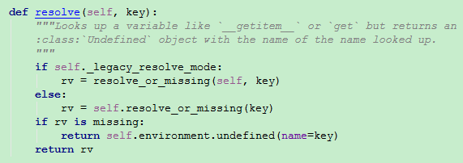
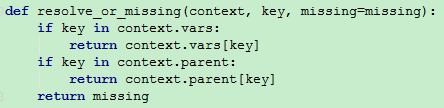
</div>

`Context`类由`new_context()`函数构建而来，`parent`参数又来源于`globals`和`vars`两个参数
<div align=center>
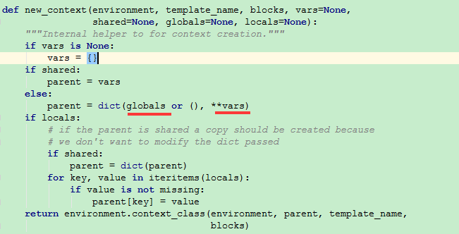
</div>


其中`globals`是全局函数会在下面介绍，`vars`来源于调用`render_template()`方法时候的第二个参数，就是传入的上下文。

<div align=center>
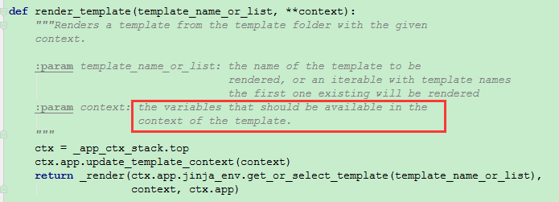
</div>


在每次解析模版的文件之前，会向模版的上下文中注入Flask类变量`template_context_processors`所返回的参数。
<div align=center>
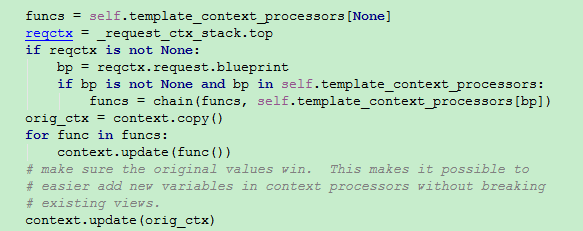
</div>

通过这个特性我们也可以使用**环境处理器**`context_processor`装饰器向Flask类变量`template_context_processors`中增加函数，来手动向模版的上下文中注入新的变量。函数返回值应该是一个字典。
<div align=center>
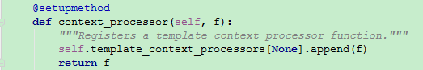
</div>

####全局函数
在过滤器中我们曾经看到，Flask初始化环境对象的时候，有一个`globals`变量，这就是`Jinja2`的全局函数，也是构成`parent`变量中的`globals`变量。所有我们可以在模版中**直接使用**配置对象`config`、应用上下文对象`g`和请求上下文对象`request`与`session`。还有`url_for()`方法和`get_flashed_message()`方法。它最终会直接传入解析过的可执行的模版对象，匹配并执行相关函数。
<div align=center>
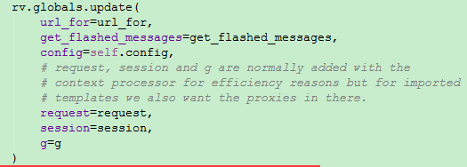
</div>

默认的全局函数在`Jinja2.defaults`模块中的变量`DEFAULT_NAMESPACE`,也可以在[官方文档](http://docs.jinkan.org/docs/jinja2/templates.html#builtin-globals)中查阅。这里介绍一点常用的

||
-|-
dict()|生成字典型变量
joiner()|它可以初始化为一个分隔符，然后第一次调用时返回空字符串，以后再调用则返回分隔符。
cycler()|给定的序列中轮循


我们可以使用装饰器`template_global`或者函数`add_template_global`增加自定义全局函数。
<div align=center>
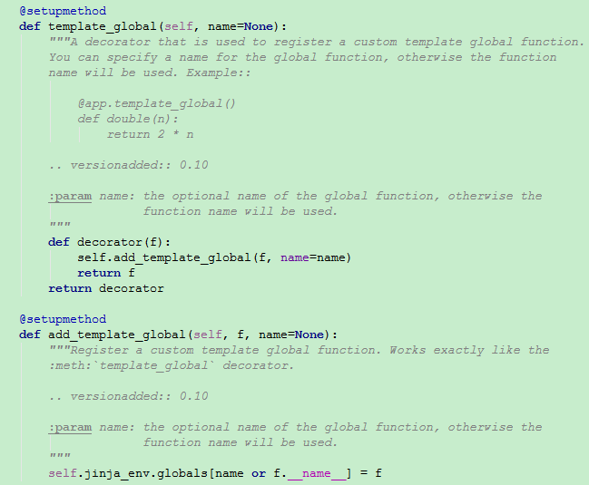
</div>

####模版继承
Jinja 最有力的部分就是模板继承。模板继承允许你创建一个基础“骨架”模板。这 个模板中包含站点的常用元素，定义可以被子模板继承的**块**。我们在父模板中定义``和``所包括的块，然后在子模版的开头定义``来声明继承覆膜板，这样子模版中的``和``就会被父模版的内容替换掉。详见[官方文档](http://dormousehole.readthedocs.io/en/latest/patterns/templateinheritance.html)
有几个要注意的点
  * 模板不支持多继承，也就是子模板中定义的块，不可能同时被两个父模板替换。
  * 模板中不能定义多个同名的块，子模板和父模板都不行，因为这样无法知道要替换哪一个部分的内容。
  * 可以通过` {{ super() }}`方法在继承父模板块的同时保留子模版的内容

####宏
宏类似常规编程语言中的函数。它们用于把常用行为作为可重用的函数，取代 手动重复的工作。我们可以通过`{% macro func() %`和``来定义一个宏。

```

    <input type="{{ type }}" name="{{ name }}" value="{{
        value|e }}" size="{{ size }}">

```
此后，我们就可以像调用函数一样调用这个宏`{{ input('username') }}`。如果在不同的模版之中，我们可以使用`import`语句来导入宏，``。


####其他
  * 忽略所有模板语法：``、``
  * `with`语句：``
  * 赋值语句：``
  * 字符串连接词`~`：`{{ “Hello ” ~ name ~ “!” }}`,同python字符串的`+`
  * 操作符`in`：`{{ 1 in [1,2,3] }}`
  * 执行表达式`do`:``，它不打印任何东西。这可以用于修改列表。
  * 空白控制：在块的开始或结束放置一个减号`-`，**标签和减号之间不能有空白。**


##附录

html测试文件
```
<!doctype html>
<title>Hello Sample</title>

  <h1>Hello {{ name }}!</h1>

  <h1>Hello World!</h1>

```

会被解析为：

```

from jinja2.runtime import LoopContext, TemplateReference, Macro, Markup, TemplateRuntimeError, missing, concat, escape, markup_join, unicode_join, to_string, identity, TemplateNotFound, Namespace
name = 'index.html'

def root(context, missing=missing, environment=environment):
    resolve = context.resolve_or_missing
    undefined = environment.undefined
    if 0: yield None
    l_0_name = resolve('name')
    pass
    yield '<!doctype html>\n<title>Hello Sample</title>\n'
    if (undefined(name='name') if l_0_name is missing else l_0_name):
        pass
        yield '\n  <h1>Hello %s!</h1>\n' % (
            escape((undefined(name='name') if l_0_name is missing else l_0_name)), 
        )
    else:
        pass
        yield '\n  <h1>Hello World!</h1>\n'

blocks = {}
debug_info = '3=12&4=15'

```

最终解析为：

```
<!doctype html>
<title>Hello Sample</title>

  <h1>Hello 123!</h1>
```