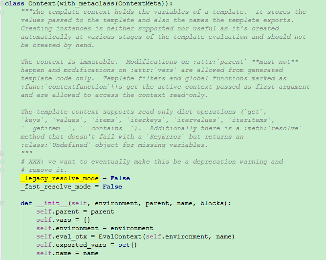

#Jinja2

Jinja2 是一个现代的，设计者友好的，仿照 Django 模板的 Python 模板语言。 它速度快，被广泛使用，并且提供了可选的沙箱模板执行环境保证安全。模板在Python的web开发中广泛使用，它能够有效的将业务逻辑和页面逻辑分开，使代码可读性增强、并且更加容易理解和维护。

##模版
模板仅仅是文本文件。它可以生成任何基于文本的格式（HTML、XML、CSV、LaTex 等等）。 它并没有特定的扩展名， .html 或 .xml 都是可以的。模板包含**变量**或**表达式**，这两者在模板求值的时候会被替换为值。

表达式有以下几种
  * 控制语句
  * 过滤器
  * 测试器
  * 函数
  * 运算符

####分隔符
  * ``：执行各种语句
  * `{{ ... }}`：把表达式的结果打印到模板上
  * `{# ... #}`：注释

####控制语句
`if`语句的执行顺序``、``、``、``，必须要由``结尾。
`for`语句的执行顺序``、``、````、``，必须由``结尾。当`for`遍历的未空时，就进入`else`语句。`for`语句中还可以访问循环的内置变量：

变量|内容
-|-
loop.index|循环迭代计数（从1开始）
loop.index0|循环迭代计数（从0开始）
loop.revindex|循环迭代倒序计数（从len开始，到1结束）
loop.revindex0|循环迭代倒序计数（从len-1开始，到0结束）
loop.first|是否为循环的第一个元素
loop.last|是否为循环的最后一个元素
loop.length|循环序列中元素的个数
loop.cycle|	在给定的序列中轮循，如上例在”odd”和”even”两个值间轮循
loop.depth|当前循环在递归中的层级（从1开始）
loop.depth0|当前循环在递归中的层级（从0开始）


####过滤器
变量可以通过过滤器修改。过滤器与变量用管道符号`|`分割，并且也 可以用圆括号传递可选参数。多个过滤器可以链式调用，前一个过滤器的输出会被作为 后一个过滤器的输入。jinja2中默认的过滤器在模块和过滤器处理方法`jinja2.filters`模块中，也可以在[官方文档](http://docs.jinkan.org/docs/jinja2/templates.html#builtin-filters)中查看。
除了`jinja2`中默认的过滤器之外，flask也会添加`tojson`过滤器，它可以把对象转换为 `JSON` 格式。
<div align=center>

</div>

####测试器

####上下文

模版的上下文对象是在`jinja2.runtime`模块里面的`Context`类。
<div align=center>

</div>

在附录中的`resolve()`函数就是获取`Context`类中的构造函数的`parent`参数

<div align=center>


</div>

`Context`类由`new_context()`函数构建而来，`parent`参数又来源于`globals`和`vars`两个参数
<div align=center>

</div>

在过滤器中我们曾经看到，Flask初始化环境对象的时候，有一个`globals`变量，这就是`parent`变量中的`globals`。所有我们可以在模版中**直接使用**配置对象`config`、应用上下文对象`g`和请求上下文对象`request`与`session`。还有`url_for()`方法和`get_flashed_message()`方法。

<div align=center>

</div>

另一个来源于调用`render_template()`方法时候的第二个参数，就是传入的上下文。

<div align=center>

</div>


在每次解析模版的文件之前，会向模版的上下文中注入Flask类变量`template_context_processors`所返回的参数。
<div align=center>

</div>

通过这个特性我们也可以使用`context_processor`装饰器向Flask类变量`template_context_processors`中增加函数，来手动向模版的上下文中注入变量。函数返回值应该是一个字典。
<div align=center>

</div>

####其他
  * 忽略所有模板语法：``、``
  * `with`语句：``
  * 赋值语句：``
  * 字符串连接词`~`：`{{ “Hello ” ~ name ~ “!” }}`,同python字符串的`+`
  * 操作符`in`：`{{ 1 in [1,2,3] }}`
  * 执行表达式`do`:``，它不打印任何东西。这可以用于修改列表。


##附录

html测试文件
```
<!doctype html>
<title>Hello Sample</title>

  <h1>Hello {{ name }}!</h1>

  <h1>Hello World!</h1>

```

会被解析为：

```

from jinja2.runtime import LoopContext, TemplateReference, Macro, Markup, TemplateRuntimeError, missing, concat, escape, markup_join, unicode_join, to_string, identity, TemplateNotFound, Namespace
name = 'index.html'

def root(context, missing=missing, environment=environment):
    resolve = context.resolve_or_missing
    undefined = environment.undefined
    if 0: yield None
    l_0_name = resolve('name')
    pass
    yield '<!doctype html>\n<title>Hello Sample</title>\n'
    if (undefined(name='name') if l_0_name is missing else l_0_name):
        pass
        yield '\n  <h1>Hello %s!</h1>\n' % (
            escape((undefined(name='name') if l_0_name is missing else l_0_name)), 
        )
    else:
        pass
        yield '\n  <h1>Hello World!</h1>\n'

blocks = {}
debug_info = '3=12&4=15'

```

最终解析为：

```
<!doctype html>
<title>Hello Sample</title>

  <h1>Hello 123!</h1>
```