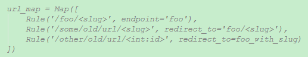
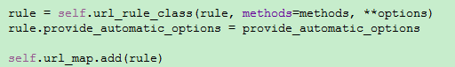
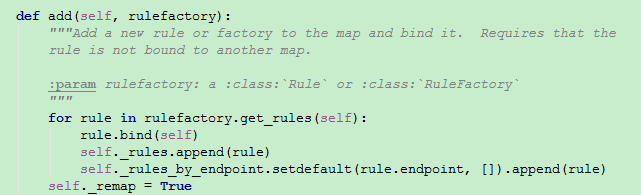
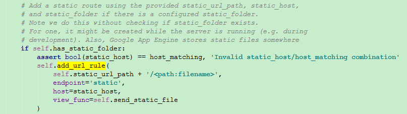
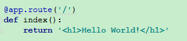
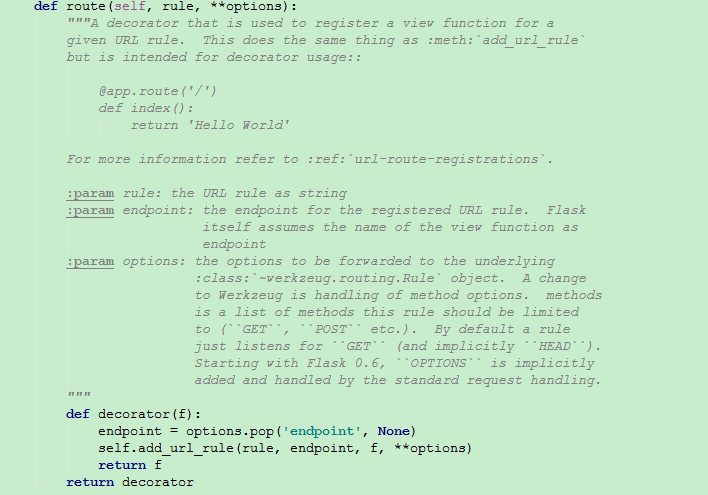
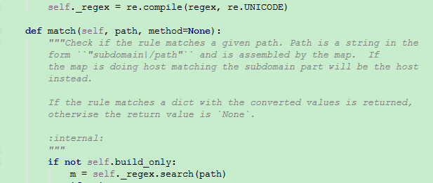
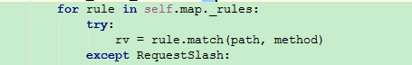

#URL

和URL链接有关的类大致由以下三个：
  * `Map`：存储所有的`URL`规则。
  * `Rule`：代表一个`URL`模式。
  * `MapAdapter`：执行`URL`匹配的具体工作。

####Map类
`Map`对象中存储了各种各样`Rule`对象。本质上是一个`Rule`对象的集合，结构如下：

Flask应用中主要通过`app.add_url_rule()`方法构建出`Rule`对象并绑定到`Map`对象里面

`Map`类中的`add()`方法会保存`Rule`对象，`Map`实例可以通过后续的调用和给定的`URL`进行匹配。
  * `_rules`：当前规则中所有的模式列表。
  * `_rules_by_endpoint`：视图函数对应的模式列表。

####Rule类
一个`Rule`的实例代表一个`URL`模式的对象，通过这个对象可以解析并匹配请求对应的视图函数。

Flask应用中`Rule`的对象来源于两点
  * `statics`静态页面文件夹的路径

  * `@app.route`的装饰器

`Rule`会把这些模式通过`compile()`方法编译成一个正则表达式，与`URL`匹配时通过`match()`方法直接和正则表达式匹配。

####MapAdapter类
`MapAdapter`类为`Map`实例的适配器。构造函数传入一个`Map`对象和环境信息。通过`match()`方法使`Map`实例中的所有`Rule`模式和环境中的信息（服务器名，子域名等等）组合出来的路径与实际的`URL`进行匹配。匹配`URL`路径所对应的视图函数。

