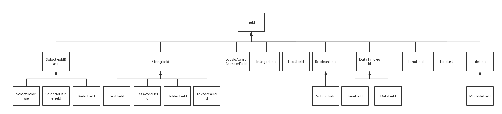

#WTF

##字段类

  * `SelectField`：单选下拉框，都是字符串
  * `SelectMultipleField`：多选下拉框，都是字符串
  * `RadioField`：`Radio`按钮
  * `StringField`：字符串字段
  * `IntegerField`：整型输入框
  * `DecimalField`：`decimal.Decimal`类型的浮点字段,**精确数字需要使用这个**
  * `FloatField`：`float`类型的浮点字段
  * `BooleanField`：布尔字段
  * `DataTimeField`：时间字段，默认格式为`Y-M-D H:M:S`
  * `DateField`：日期字段，默认格式为`Y-M-D`
  * `TimeField`：时间字段，默认格式为`H:M`
  * `FormFied`：表单字段，用来载入一个表单。