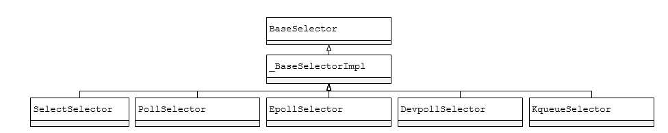

#Selectors
selector支持监视被注册的文件对象中指定的IO事件，一个文件对象是一个文件描述符（`fileno`方法）。任意的对象都可以和一个文件对象关联，用来保存环境信息，设置回调等。一个selector依赖于系统有很多种实现(select(), poll(), epoll()...)。`DefaultSelector`实在当前操作系统中最效率的实现方式。

这五种主要的Selector区别为：
  * SelectSelector：支持Unix和Windows（由WinSock库提供，仅处理WinSock内部提供的文件描述符）
  * PollSelector：并且所有操作系统都支持
  * EpollSelector：仅支持Linux系统
  * DevpollSelector：仅支持Solaris系统
  * KqueueSelector：仅支持BSD系统

主要的变量：
  * fileobj：表示已经注册的文件对象；
  * fd：表示文件对象的描述符，是一个整数，它是文件对象的 fileno()方法的返回值；
  * events：表示注册一个文件对象时，我们等待的events，有两个值。
    * EVENT_READ ：      表示可读的； 它的值其实是1；
    * EVENT_WRITE：      表示可写的； 它的值其实是2；
  * data：表示注册一个文件对象是邦定的data；

主要用的函数
  * `register(fileobj, events, data=None)`：注册一个文件对象或含有`fileno`方法的类，返回一个SelectorKey类的实例
  * `unregister(fileobj)`：注销一个已经注册过的文件对象，返回一个SelectorKey类的实例
  * `modify(fileobj, events, data=None)`：用于修改一个注册过的文件对象，比如从监听可读变为监听可写；它其实就是register() 后再跟unregister(),但是使用modify( ) 更高效；返回一个SelectorKey类的实例；
  * `select(timeout=None)`：返回一个(key, events)的元组列表，其中key是一个SelectorKey类的实例。
    * timeout > 0：则指定了最长等待时间（秒）
    * timeout <= 0：直接报告当前准备好的文件对象
    * timeout为None：调用阻塞，直到受到监视的文件对象准备就绪
  * `close()`：关闭 selector。
  * `get_key(fileobj)`：返回注册的文件对象的SelectorKey类的实例
  * `get_map`：以字典形式`{fileObj:SelectKey}`获取所有的数据