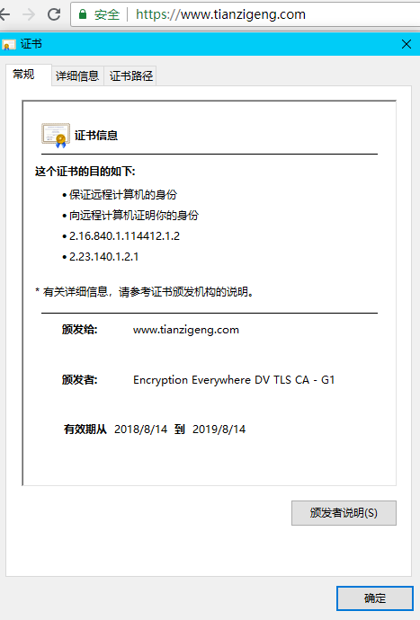

#HTTPS
超文本传输安全协议（Hypertext Transfer Protocol Secure）是一种透过计算机网络进行安全通信的传输协议。HTTPS经由HTTP进行通信，但利用SSL/TLS来加密数据包。HTTPS开发的主要目的，是提供对网站服务器的身份认证，保护交换数据的隐私与完整性。这个协议由网景公司在1994年首次提出，随后扩展到互联网上。

建构在SSL/TLS之上的 http协议

####HTTPS与HTTP的区别

http是无状态连接，HTTPS协议是由SSL+HTTP协议构建的可进行加密传输、身份认证的网络协议 要比http协议安全

|类型|HTTP|HTTPS|
|-|-|
|传输|明文传输|ssl加密协议传输|
|握手次数|3|12|
|默认端口|80|443|
|证书|不需要证书|到CA申请证书|
|SEO|百度收录 谷歌收录|百度半开放收录 谷歌提高优先级|

####SSL

HTTP的风险
  * 窃听风险（eavesdropping）：第三方可以获知通信内容。
  * 篡改风险（tampering）：第三方可以修改通信内容。
  * 冒充风险（pretending）：第三方可以冒充他人身份参与通信。

SSL/TLS协议是为了解决这三大风险而设计的，希望达到：
  * 所有信息都是加密传播，第三方无法窃听。
  * 具有校验机制，一旦被篡改，通信双方会立刻发现。
  * 配备身份证书，防止身份被冒充。

接下来，客户端与服务器进入加密通信，就完全是使用普通的HTTP协议，只不过用"会话密钥"加密内容。

####CA证书

