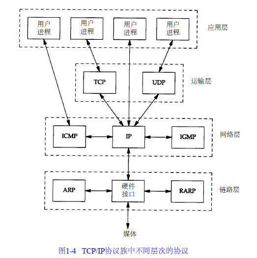
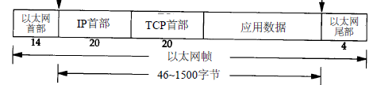
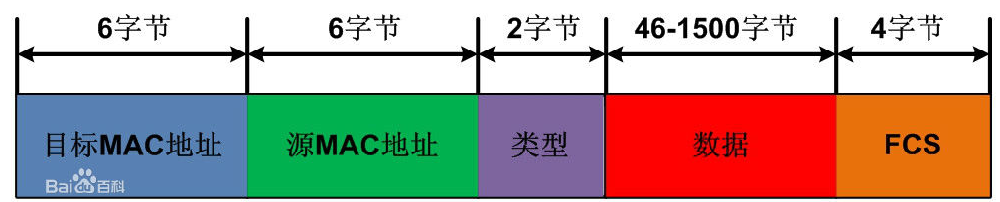
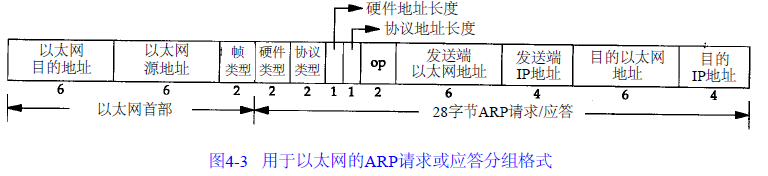
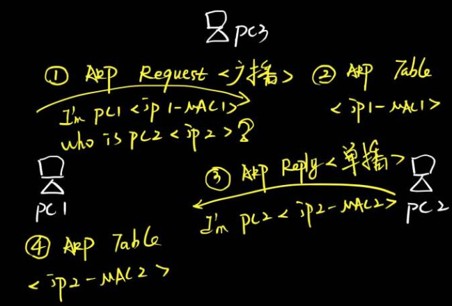
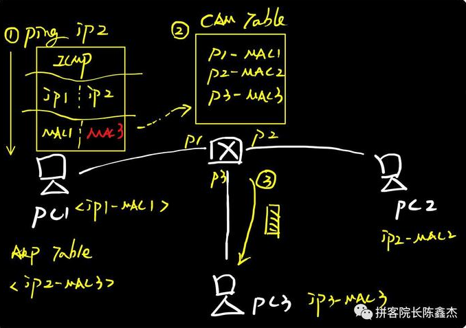
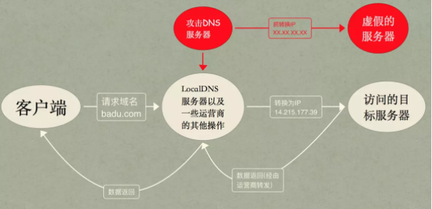
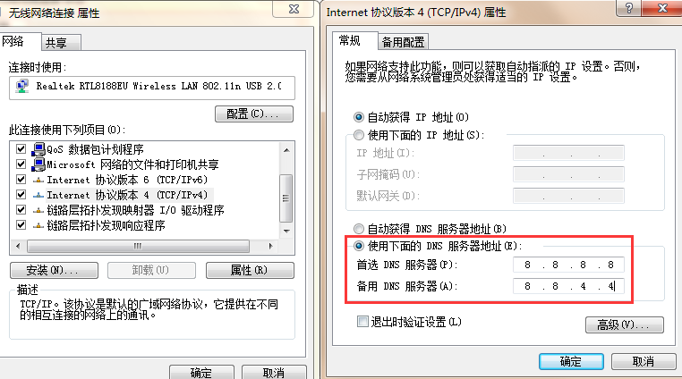

#概述

##以太网
是一个数字设备公司（ Digital Equipment Corp.）、英特尔公司（ I n t e l C o r p .）和X e r o x公司在1 9 8 2年联合公布的一个标准。当今T C P / I P采用的主要的局域网技术。在`TCP/IP`协议族中，链路层主要有三个目的：
  * 发送/接收IP数据报
  * 发送/接受ARP请求/应答
  * 发送RARP请求/应答

MAC地址：指的物理地址、硬件地址，一般在网卡中。

##IP
提供不可靠，无连接的数据报传送服务。
  * 不可靠：不保证IP数据包能够成功的到达目的地
  * 无连接：不维护后续数据报的状态信息（每个数据报都是独立的）。

##ARP
ARP（Address Resolution Protocol）即地址解析协议， 用于实现从 IP 地址到 MAC 地址的映射，即询问目标IP对应的MAC地址。
网络接口有一个硬件地址（一个48 bit的值，标识不同的以太网）。在硬件层次上进行的数据帧交换必须有正确的接口地址。但是，T C P / I P有自己的地址： 32 bit的I P地址。知道主机的I P地址并不能让内核发送一帧数据给主机。**当一台主机把以太网数据帧发送到位于同一局域网上的另一台主机时，是根据48 bit的以太网地址来确定目的接口的**，内核（如以太网驱动程序）必须知道目的端的硬件地址才能发送数据，设备驱动程序从不检查I P数据报中的目的I P地址。

**TCP/IP协议栈一个"最不安全的协议"。**

####ARP原理
  * 源主机发送一份称作A R P请求的以太网数据帧给以太网上的每个主机。**这个过程是广播。**
  * 目的主机的A R P层收到这份广播报文后，识别出这是发送端在寻问它的I P地址。
  * 目的主机发送一个A R P应答。这个A R P应答包含I P地址及对应的硬件地址。**这个过程是一个单播。**
  * 源主机收到应答，将信息存储到本地**【ARP缓存表】**

####ARP攻击

PC1、PC2、PC3三台主机共同连接到交换机SW1上面，PC3是攻击者电脑，其他两台是正常电脑。现在PC1需要和PC2通信。

  * 1.PC1通过ARP请求包询问PC2的**MAC地址**，由于采用广播形式，所以交换机将ARP请求包从接口P1广播到P2和PC3。
  * 2.PC2根据询问信息，返回ARP单播回应包（IP2-MAC2）。
  * 3.正常情况下，若收到的ARP请求不是给自己的会直接丢弃。但此时PC3作为攻击者，发起了ARP回应包：我就是PC2（IP2-MAC3）。

  * 4.此时PC1收到两个ARP回应包，内容分别如下：
    * 我是PC2，我的IP地址是IP2，我的MAC地址是MAC2；（正确的地址）
    * 我是PC2，我的IP地址是IP2，我的MAC地址是**MAC3**；（攻击者的地址）
    * Tips:网络协议里ARP和CAM表，就是遵循的方式为"后到优先"原则。
  * 5.攻击者通过**持续不停发出ARP欺骗包，覆盖掉正常的ARP回应包**。
  * 6.PC1最终记录的是虚假的ARP映射：**IP2<->MAC3**
  * 7.PC1本来要发给PC2的数据包，落到了PC3（攻击者）手里，这就完成了一次完整的ARP攻击。

常见的后果：
  * **断网/限速攻击**：PC1发给PC2的数据在PC3这里可以直接丢弃。
  * **数据窃取**：任何基于明文传输的应用，都可以被窃取数据。（http、telnet、ftp、pop3/smtp/imap）

####ARP防御
  * 在交换机（路由器）写死IP地址和MAC地址的对应。

##DNS
域名系统（ D N S）是一种用于T C P / I P应用程序的分布式数据库，它提供主机名字和I P地址之间的转换。
T C P打开一个连接或使用U D P发送一个数据报之前。心须将一个主机名转换为一个I P地址。操作系统内核中的T C P / I P协议族对于D N S一点都不知道。
对D N S的访问是通过一个地址解析器（ r e s o l v e r）来完成的

####DNS劫持
对DNS解析服务器做手脚，或者是使用伪造的DNS解析服务器可以通过下图来展示

####防御
选择信得过的DNS解析服务器，例如谷歌公共域名解析服务。

##TCP

##HTTP

####HTTP劫持

####HTTP劫持应对
由于是运营商层次的劫持，并不是网站开发者放的。所以，终端用户无法采取技术手段屏蔽。只有一个法子，投诉的网络提供者，是当地的移动、联通电信。

##HTTPS