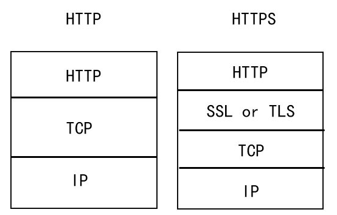

#概述

<div align=center>

</div>


<div align=center>

</div>

##以太网
是一个数字设备公司（ Digital Equipment Corp.）、英特尔公司（ I n t e l C o r p .）和X e r o x公司在1 9 8 2年联合公布的一个标准。当今T C P / I P采用的主要的局域网技术。在`TCP/IP`协议族中，链路层主要有三个目的：
  * 发送/接收IP数据报
  * 发送/接受ARP请求/应答
  * 发送RARP请求/应答

MAC地址：指的物理地址、硬件地址，一般在网卡中。
<div align=center>

</div>

##IP
提供不可靠，无连接的数据报传送服务。
  * 不可靠：不保证IP数据包能够成功的到达目的地
  * 无连接：不维护后续数据报的状态信息（每个数据报都是独立的）。

<div align=center>

</div>


##ARP
ARP（Address Resolution Protocol）即地址解析协议， 用于实现从 IP 地址到 MAC 地址的映射，即询问目标IP对应的MAC地址。
网络接口有一个硬件地址（一个48 bit的值，标识不同的以太网）。在硬件层次上进行的数据帧交换必须有正确的接口地址。但是，T C P / I P有自己的地址： 32 bit的I P地址。知道主机的I P地址并不能让内核发送一帧数据给主机。**当一台主机把以太网数据帧发送到位于同一局域网上的另一台主机时，是根据48 bit的以太网地址来确定目的接口的**，内核（如以太网驱动程序）必须知道目的端的硬件地址才能发送数据，设备驱动程序从不检查I P数据报中的目的I P地址。

**TCP/IP协议栈一个"最不安全的协议"。**

<div align=center>

</div>

####ARP原理
  * 源主机发送一份称作A R P请求的以太网数据帧给以太网上的每个主机。**这个过程是广播。**
  * 目的主机的A R P层收到这份广播报文后，识别出这是发送端在寻问它的I P地址。
  * 目的主机发送一个A R P应答。这个A R P应答包含I P地址及对应的硬件地址。**这个过程是一个单播。**
  * 源主机收到应答，将信息存储到本地**【ARP缓存表】**

<div align=center>

</div>

####ARP攻击

PC1、PC2、PC3三台主机共同连接到交换机SW1上面，PC3是攻击者电脑，其他两台是正常电脑。现在PC1需要和PC2通信。
<div align=center>

</div>
  * 1.PC1通过ARP请求包询问PC2的**MAC地址**，由于采用广播形式，所以交换机将ARP请求包从接口P1广播到P2和PC3。
  * 2.PC2根据询问信息，返回ARP单播回应包（IP2-MAC2）。
  * 3.正常情况下，若收到的ARP请求不是给自己的会直接丢弃。但此时PC3作为攻击者，发起了ARP回应包：我就是PC2（IP2-MAC3）。
<div align=center>

</div>

  * 4.此时PC1收到两个ARP回应包，内容分别如下：
    * 我是PC2，我的IP地址是IP2，我的MAC地址是MAC2；（正确的地址）
    * 我是PC2，我的IP地址是IP2，我的MAC地址是**MAC3**；（攻击者的地址）
    * Tips:网络协议里ARP和CAM表，就是遵循的方式为"后到优先"原则。
  * 5.攻击者通过**持续不停发出ARP欺骗包，覆盖掉正常的ARP回应包**。
  * 6.PC1最终记录的是虚假的ARP映射：**IP2<->MAC3**
  * 7.PC1本来要发给PC2的数据包，落到了PC3（攻击者）手里，这就完成了一次完整的ARP攻击。
<div align=center>

</div>

常见的后果：
  * **断网/限速攻击**：PC1发给PC2的数据在PC3这里可以直接丢弃。
  * **数据窃取**：任何基于明文传输的应用，都可以被窃取数据。（http、telnet、ftp、pop3/smtp/imap）

####ARP防御
  * 在交换机（路由器）写死IP地址和MAC地址的对应。

##DNS
域名系统（ D N S）是一种用于T C P / I P应用程序的分布式数据库，它提供主机名字和I P地址之间的转换。T C P打开一个连接或使用U D P发送一个数据报之前。心须将一个主机名转换为一个I P地址。操作系统内核中的T C P / I P协议族对于D N S一点都不知道。

主机名到IP地址的映射有两种方式：
  * 静态映射：每台设备上都配置主机到IP地址的映射，各设备独立维护自己的映射表，而且只供本设备使用；Windows本地的映射表在`C:\WINDOWS\system32\drivers\etc\hosts`文件中
<div align=center>

</div>
  * 动态映射：在专门的DNS服务器上配置主机到IP地址的映射，网络上需要使用主机名通信的设备，首先需要到DNS服务器查询主机所对应的IP地址
<div align=center>

</div>

####DNS劫持
对DNS解析服务器做手脚，或者是使用伪造的DNS解析服务器。将域名解析到错误的IP地址。
<div align=center>

</div>

####防御
选择信得过的DNS解析服务器，例如谷歌公共域名解析服务。

<div align=center>

</div>


##TCP
TCP提供一种面向连接的、可靠的字节流服务。
  * 面向连接意味着必须先建立一个TCP连接才能交换数据
  * 提供处理数据包丢失，重复或是顺序紊乱等不良情况的机制

<div align=center>

</div>

  * ACK：确认序列号有效
  * RST：重建连接
  * SYN：同步序号用来发起一个连接
  * FIN：发端完成发送任务

####三次握手
  * 第一次握手：客户端发送一个包含客户端初始序列号的SYN段的TCP请求。
  * 第二次握手：服务器返回包含服务器初始SYN报文段应答，并将确认序号设置为客户端ISN+1来对客户端SYN报文段进行确认。
  * 第三次握手：客户端将服务器ISN+1来对服务器的SYN报文段进行确认。
<div align=center>

</div>

####TCP欺骗
  * (1)攻击者X伪造数据包：B->A：SYN(ISN C)，源IP地址使用B，初始序列号ISN为C，给目标主机发送TCP的SYN包，请求建立连接。
  * (2)目标主机回应数据包：A->B：SYN(ISN S)，ACK(ISN C)，初始序列号为S，确认序号为C。由于B处于拒绝服务状态，不会发出响应包。攻击者X使用嗅探工具捕获TCP报文段，得到初始序列号S。
  * (3)攻击者X伪造数据包：B->A:ACK(ISN S),完成三次握手建立TCP连接。
  * (4)攻击者X一直使用B的IP地址与A进行通信。

####防御
  * 路由器拒绝来自外网而源IP是内网的数据包;
  * 使用TCP段加密工具加密

##HTTP
>超文本传输协议（HyperText Transfer Protocol）是一种用于分布式、协作式和超媒体信息系统的应用层协议。HTTP是万维网的数据通信的基础。设计HTTP最初的目的是为了提供一种发布和接收HTML页面的方法。

####HTTP劫持
 在运营商的路由器节点上，设置协议检测，一旦发现是HTTP请求，而且是html类型请求，则拦截处理。后续做法往往分为2种，
   * 第一种是类似DNS劫持返回302让用户浏览器跳转到另外的地址，
   * 第二种是在服务器返回的HTML数据中插入js或dom节点（广告）。
<div align=center>

</div>

####HTTP劫持应对
  * 1.使用HTTPS来连接网页。
  * 2.运营商层次的劫持，投诉的网络提供者，是当地的移动、联通电信。
<div align=center>

</div>

##HTTPS
>超文本传输安全协议（Hypertext Transfer Protocol Secure）是一种透过计算机网络进行安全通信的传输协议。HTTPS经由HTTP进行通信，但利用SSL/TLS来加密数据包。HTTPS开发的主要目的，是提供对网站服务器的身份认证，保护交换数据的隐私与完整性。这个协议由网景公司在1994年首次提出，随后扩展到互联网上。

HTTPS=数据加密+网站认证+完整性验证+HTTP

HTTPS 主要用途：
  * 一是通过证书等信息确认网站的真实性；
  * 二是建立加密的信息通道；
  * 三是数据内容的完整性。


####HTTPS与HTTP的区别

http是无状态连接，HTTPS协议是由SSL+HTTP协议构建的可进行加密传输、身份认证的网络协议 要比http协议安全

|类型|HTTP|HTTPS|
|-|-|
|传输|明文传输|ssl加密协议传输|
|握手次数|3|12|
|默认端口|80|443|
|证书|不需要证书|到CA申请证书|
|SEO|百度收录<br>谷歌收录|百度半开放收录<br>谷歌提高优先级|

https在tcp基础上有一层ssl协议。
<div align=center>

</div>

在浏览器上面,https链接会有一个小锁，http连接则没有
<div align=center>


</div>

####HTTPS流程

HTTPS主要流程：
<div align=center>


</div>


####HTTP风险
HTTP的风险
  * 窃听风险（eavesdropping）：第三方可以获知通信内容。
  * 篡改风险（tampering）：第三方可以修改通信内容。
  * 冒充风险（pretending）：第三方可以冒充他人身份参与通信。

####SSL
SSL/TLS协议是为了解决这三大风险而设计的，希望达到：
  * 所有信息都是加密传播，第三方无法窃听。
  * 具有校验机制，一旦被篡改，通信双方会立刻发现。
  * 配备身份证书，防止身份被冒充。

```
在正确使用 SSL 证书的情况下，攻击者只能看见您的网络连接至哪个 IP 和端口，以及传送的大概数据量。攻击者可能会终止连接，但服务器和用户都能判断连接已被第三方断开。但是，他们无法拦截任何信息，因此攻击也基本上是无功而返。
```


####消息认证码MAC

<div align=center>

</div>

  * 1：假设通信双方 A 和 B 共享密钥 K，
  * 2：A用消息认证码算法将 K 和消息 M 计算出消息验证码 Mac，然后将 Mac 和 M 一起发送给 B。
  * 3：B 接收到 Mac 和 M 后，利用 M 和 K 计算出新的验证码 Mac*：
    * 若 Mac*和Mac 相等则验证成功，证明消息未被篡改。
    * 由于攻击者没有密钥 K，攻击者修改了消息内容后无法计算出相应的消息验证码，因此 B 就能够发现消息完整性遭到破坏。

####CA证书
<div align=center>

</div>
