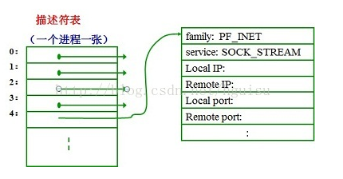
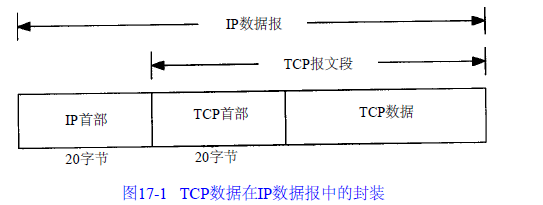
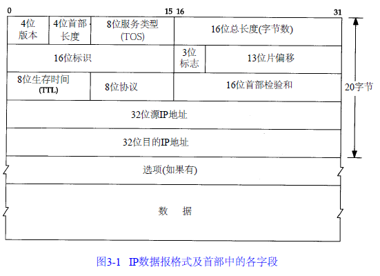
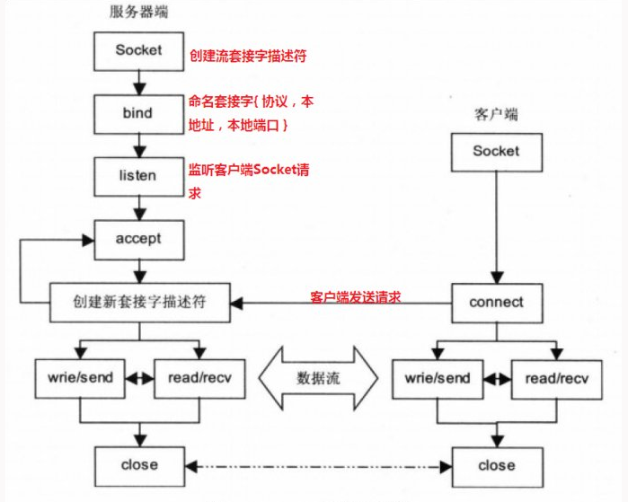
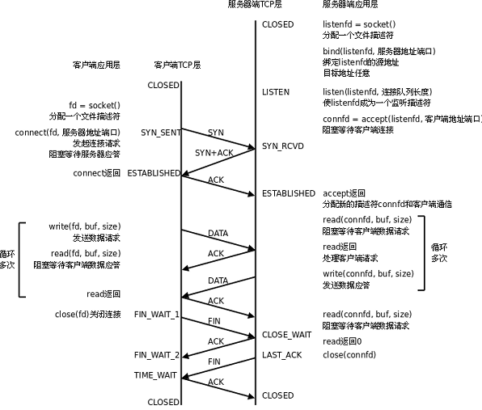

#Socket

Socket是应用层与TCP/IP协议族通信的中间软件抽象层，socket本质是一组编程接口(API)，对TCP/IP的封装。它把TCP/IP层复杂的操作抽象为几个简单的接口供应用层调用已实现进程在网络中通信。

<div align=center>

</div>

socket编程起源于Unix，而Unix/Linux基本哲学之一就是“一切皆文件”，都可以用“打开open –> 读写write/read –> 关闭close”模式来操作。Socket就是该模式的一种特殊的文件，一些socket函数就是对其进行的操作（读/写IO、打开、关闭），socket和file的区别：
  * file是针对某个指定文件进行【打开】【读写】【关闭】
  * socket是针对服务端和客户端Socket文件进行【打开】【读写】【关闭】


当应用程序要创建一个套接字时，操作系统就返回一个小整数作为描述符，应用程序则使用这个描述符来引用该套接字需要I/O请求的应用程序请求操作系统打开一个文件。操作系统就创建一个文件描述符提供给应用程序访问文件。从应用程序的角度看，文件描述符是一个整数，应用程序可以用它来读写文件。下图显示，操作系统如何把文件描述符实现为一个指针数组，这些指针指向内部数据结构。

<div align=center>

</div>

对于每个程序系统都有一张单独的表。精确地讲，系统为每个运行的进程维护一张单独的文件描述符表。当进程打开一个文件时，系统把一个指向此文件内部数据结构的指针写入文件描述符表，并把该表的索引值返回给调用者 。应用程序只需记住这个描述符，并在以后操作该文件时使用它。操作系统把该描述符作为索引访问进程描述符表，通过指针找到保存该文件所有的信息的数据结构。

##Socket结构
socket的结构很简单，只有三个元素，协议，端口号，IP地址。

<div align=center>

</div>

ip地址是互联网上的每一个网络和每一台主机分配一个逻辑地址，以此来屏蔽物理地址的差异，信息存储于ip部首中。

<div align=center>

</div>

端口号用于**寻找发端和收端应用进程**，信息存储于tcp部首中。

<div align=center>

</div>


##Socket流程
socket 在网络系统中的作用如下:
 * socket 位于网络协议之上，屏蔽了不同网络协议之间的差异。
 * socket 是网络编程的入口，它提供了大量的系统调用，构成了网络程序的主体。
* TCP发送数据时，已建立好TCP链接，所以不需要指定地址，而UDP是面向无连接的，每次发送都需要指定发送给谁。
* 服务器与客户端不能直接发送列表，元素，字典等带有数据类型的格式，发送的内容必须是字符串数据。

<div align=center>

</div>

<div align=center>

</div>

####socket函数
 socket函数对应于普通文件的打开操作。普通文件的打开操作返回一个文件描述字，而socket()用于创建一个socket描述符（socket descriptor），它唯一标识一个socket。这个socket描述字跟文件描述字一样，后续的操作都有用到它，把它作为参数，通过它来进行一些读写操作。

`int socket(int protofamily, int type, int protocol);//返回sockfd`
  * protofamily：又称为协议族（family），常用的协议族有，AF_INET(IPV4)、AF_INET6(IPV6)
  * type：指定socket类型。常用的socket类型有，SOCK_STREAM、SOCK_DGRAM、SOCK_RAW、SOCK_PACKET、SOCK_SEQPACKET
  * protocol：指定协议。常用的协议有，IPPROTO_TCP、IPPTOTO_UDP、IPPROTO_SCTP、IPPROTO_TIPC等，它们分别对应TCP传输协议、UDP传输协议、STCP传输协议、TIPC传输协议。

当我们调用socket创建一个socket时，返回的socket描述字它存在于协议族（address family，AF_XXX）空间中，但没有一个具体的地址。如果想要给它赋值一个地址，就必须调用bind()函数，否则就当调用connect()、listen()时系统会自动随机分配一个端口。

####bind函数
把一个地址族中的特定地址赋给socket。例如对应AF_INET、AF_INET6就是把一个ipv4或ipv6地址和端口号组合赋给socket。
`int bind(int sockfd, const struct sockaddr *addr, socklen_t addrlen);`
  * sockfd：即socket描述字，它是通过socket()函数创建了，唯一标识一个socket。bind()函数就是将给这个描述字绑定一个名字。
  * addr：一个const struct sockaddr *指针，指向要绑定给sockfd的协议地址。
  * addrlen：对应的是地址的长度。

通常服务器在启动的时候都会绑定一个众所周知的地址（如ip地址+端口号），用于提供服务，客户就可以通过它来接连服务器；而客户端就不用指定，有系统自动分配一个端口号和自身的ip地址组合。这就是为什么通常服务器端在listen之前会调用bind()，而客户端就不会调用，而是在connect()时由系统随机生成一个。

```
网络字节序与主机字节序

主机字节序就是我们平常说的大端和小端模式：不同的CPU有不同的字节序类型，这些字节序是指整数在内存中保存的顺序，这个叫做主机序。引用标准的Big-Endian和Little-Endian的定义如下：
　　a) Little-Endian就是低位字节排放在内存的低地址端，高位字节排放在内存的高地址端。
　　b) Big-Endian就是高位字节排放在内存的低地址端，低位字节排放在内存的高地址端。

网络字节序：4个字节的32 bit值以下面的次序传输：首先是0～7bit，其次8～15bit，然后16～23bit，最后是24~31bit。这种传输次序称作大端字节序。由于TCP/IP首部中所有的二进制整数在网络中传输时都要求以这种次序，因此它又称作网络字节序。字节序，顾名思义字节的顺序，就是大于一个字节类型的数据在内存中的存放顺序，一个字节的数据没有顺序的问题了。

所以：在将一个地址绑定到socket的时候，请先将主机字节序转换成为网络字节序，而不要假定主机字节序跟网络字节序一样使用的是Big-Endian
```

####listen和connect函数
socket()函数创建的socket默认是一个主动类型的，listen函数将socket变为被动类型的，等待客户的连接请求。
`int listen(int sockfd, int backlog);`
  * sockfd：要监听的socket描述字
  * backlog：相应socket可以排队的最大连接个数


客户端通过调用connect函数来建立与TCP服务器的连接。
`int connect(int sockfd, const struct sockaddr *addr, socklen_t addrlen);`
  * sockfd：客户端的socket描述字、
  * addr：服务器的socket地址
  * addrlen：socket地址的长度


####accept函数

TCP服务器端依次调用socket()、bind()、listen()之后，就会监听指定的socket地址了。TCP客户端依次调用socket()、connect()之后就向TCP服务器发送了一个连接请求。TCP服务器监听到这个请求之后，就会调用accept()函数取接收请求，这样连接就建立好了。之后就可以开始网络I/O操作了，即类同于普通文件的读写I/O操作。
`int accept(int sockfd, struct sockaddr *addr, socklen_t *addrlen); //返回连接connect_fd`
  * sockfd：监听套接字，这个套接字用来监听一个端口，当有一个客户与服务器连接时，它使用这个一个端口号，而此时这个端口号正与这个套接字关联。
  * addr：这是一个结果参数，它用来接受一个返回值，这返回值指定客户端的地址，当然这个地址是通过某个地址结构来描述的，用户应该知道这一个什么样的地址结构。如果对客户的地址不感兴趣，那么可以把这个值设置为NULL。
  * len：它也是结果的参数，用来接受上述addr的结构的大小的，它指明addr结构所占有的字节个数。同样的，它也可以被设置为NULL。

如果accept成功返回，则服务器与客户已经正确建立连接了，此时服务器通过accept返回的套接字来完成与客户的通信。
accept默认会阻塞进程，直到有一个客户连接建立后返回，它返回的是一个新可用的套接字，这个套接字是连接套接字。
```
监听套接字和连接套接字

监听套接字: 监听套接字正如accept的参数sockfd，它是监听套接字，在调用listen函数之后，是服务器开始调用socket()函数生成的，称为监听socket描述字(监听套接字)

连接套接字：一个套接字会从主动连接的套接字变身为一个监听套接字；而accept函数返回的是已连接socket描述字(一个连接套接字)，它代表着一个网络已经存在的点点连接。

一个服务器通常通常仅仅只创建一个监听socket描述字，它在该服务器的生命周期内一直存在。内核为每个由服务器进程接受的客户连接创建了一个已连接socket描述字，当服务器完成了对某个客户的服务，相应的已连接socket描述字就被关闭。
```


##Python实例

####服务端

```
# -*- coding:utf-8 -*-

import socket

ip_port = ('127.0.0.1',9999)

sk = socket.socket()
sk.bind(ip_port)
sk.listen(5)#最大链接数

while True:
    print 'server waiting...'
    conn,addr = sk.accept()

    client_data = conn.recv(1024)
    print(client_data)
    conn.sendall('test server')

    conn.close()
```

####客户端

```
# -*- coding:utf-8 -*-
import socket
ip_port = ('127.0.0.1',9999)

sk = socket.socket()
sk.connect(ip_port)
sk.sendall('test client')

server_reply = sk.recv(1024)
print(server_reply)

sk.close()
```