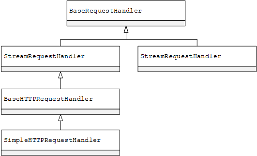

#RequireHandler

####BaseHTTPRequestHandler
HTTP请求处理的基类,该协议识别请求的三个部分：
  * 请求行：`<command> <path> <version>`
    * `command`：请求方法，一般为`GET`或`POST`
    * `path`：请求的URL，URL编码规范 (使用 %xx 来解释 ASCII 字符，其中xx为字符16进制).
    * `version`：HTTP版本，`HTTP/1.0`或者`HTTP/1.1`
  * RFC-822形式的请求头：每行通过CRLF分开
  * 消息主体（数据）
  * 请求头和消息中间由空行隔开

主要的方法有：
  * `handle()`：这个方法是请求处理类真正处理请求具体工作的方法，例如解析到来的请求，处理数据，并发回响应等。在BaseHTTPRequestHandler中它是一个入口文件，将调用其他的方法完成请求处理。
  * `handle_one_request()`：用于处理请求。
  * `parse_request()`：解析请求
  * `send_error()`：发回错误响应
  * `send_response()`：创建响应首行和响应首部等内容。
  * `send_header()`：设置响应首部内容。
  * `end_headers()`：调用此方法可以在首部后增加一个空行，表示首部内容结束
  * `do_SPAM()`：这个方法中的`SPAM`指代GET、POST、HEAD等请求方法，需要在请求处理类中构建具体的请求处理方法，例如`do_GET`处理GET请求，`do_POST`处理POST请求。`do_SPAM()` 方法可以调用`send_response()`、`send_header()`、`end_headers()`等方法创建响应首行和响应首部等内容。