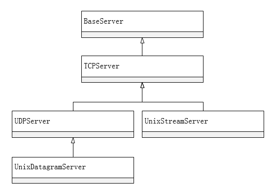
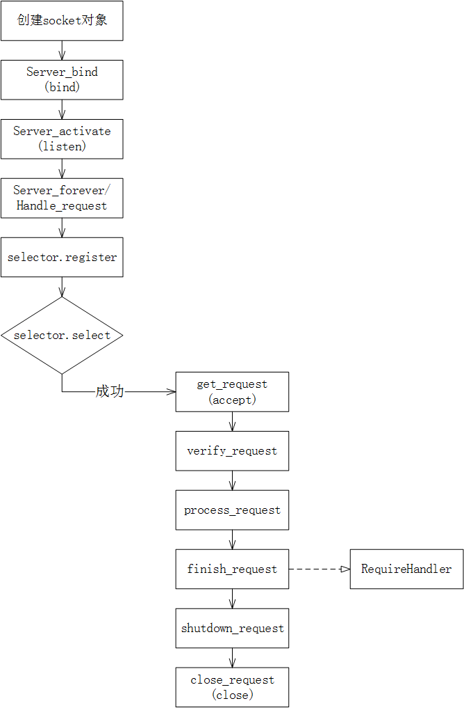

##SocketServer
>SocketServer是Python标准库中的一个模块,其作用是创建网络服务器。

SocketServer其中用于处理网络请求的功能，可以通过两个主要的类来实现：一个是服务器类，一个是请求处理类。
  * 服务器类（server class）：处理通信问题，也就是建立连接的过程。
  * 请求处理类（request handle class）：处理“协议”问题，如解释到来的数据、处理数据并把数据发回给客户端等。也就是事务逻辑。

一般情况下，所有的服务，都是先建立连接，也就是建立一个服务类的实例，然后开始处理用户请求，也就是建立一个请求处理类的实例。

####服务器类

SocketServer模块中定义了五种服务器类。
  * BaseServer(服务器的基类，定义了API,不直接对外服务)
  * TCPServer(使用TCP/IP套接字)
  * UDPServer(使用数据报套接字)
  * UnixStreamServer(使用UNIX域套接字，只适用UNIX平台)
  * UnixDatagramServer(使用UNIX域套接字，只适用UNIX平台)

<div align=center>

</div>


####TCP服务器基础方法
```
class BaseServer:
    def __init__(self, server_address, RequestHandlerClass):
        """Constructor.  May be extended, do not override."""
        self.server_address = server_address
        self.RequestHandlerClass = RequestHandlerClass
        self.__is_shut_down = threading.Event()
        self.__shutdown_request = False
```

包含的主要方法有：
  * `BaseServer.fileno()`：返回服务器监听套接字的整数文件描述符。通常用来传递给select.select(), 以允许一个进程监视多个服务器。
  * `BaseServer.handle_request()`：处理单个请求。处理顺序：get_request(), verify_request(), process_request()。如果用户提供handle()方法抛出异常，将调用服务器的handle_error()方法。如果self.timeout内没有请求收到， 将调用handle_timeout()并返回handle_request()。
  * `BaseServer.serve_forever(poll_interval=0.5)`: 处理请求，直到一个明确的shutdown()请求。每poll_interval秒轮询一次shutdown。忽略self.timeout。如果你需要做周期性的任务，建议放置在其他线程。
  * `BaseServer.shutdown()`：告诉serve_forever()循环停止并等待其停止。


包含的变量：
  * `BaseServer.address_family`: 地址家族，比如socket.AF_INET和socket.AF_UNIX。
  * `BaseServer.RequestHandlerClass`：用户提供的请求处理类，这个类为每个请求创建实例。
  * `BaseServer.server_address`：服务器侦听的地址。格式根据协议家族地址的各不相同，请参阅socket模块的文档。
  * `BaseServer.socketSocket`：服务器上侦听传入的请求socket对象的服务器。
  * `BaseServer.allow_reuse_address`：服务器是否允许地址的重用。默认为false ，并且可在子类中更改。
  * `BaseServer.request_queue_size`:请求队列的大小。如果单个请求需要很长的时间来处理，服务器忙时请求被放置到队列中，最多可以放request_queue_size个。一旦队列已满，来自客户端的请求将得到 “Connection denied”错误。默认值通常为5 ，但可以被子类覆盖。
  * `BaseServer.socket_type`：服务器使用的套接字类型; socket.SOCK_STREAM和socket.SOCK_DGRAM等。
  * `BaseServer.timeout`：超时时间，以秒为单位，或 None表示没有超时。如果handle_request()在timeout内没有收到请求，将调用handle_timeout()。

被子类重载的函数：
  * `BaseServer.finish_request()`：实际处理RequestHandlerClass发起的请求并调用其handle()方法。 常用。
  * `BaseServer.get_request()`：接受socket请求，并返回二元组包含要用于与客户端通信的新socket对象，以及客户端的地址。
  * `BaseServer.handle_error(request, client_address)`：如果RequestHandlerClass的handle()方法抛出异常时调用。默认操作是打印traceback到标准输出，并继续处理其他请求。
  * `BaseServer.handle_timeout()`：超时处理。默认对于forking服务器是收集退出的子进程状态，threading服务器则什么都不做。
  * `BaseServer.process_request(request, client_address)` :调用finish_request()创建RequestHandlerClass的实例。如果需要，此功能可以创建新的进程或线程来处理请求,ForkingMixIn和ThreadingMixIn类做到这点。常用。
  * `BaseServer.server_activate()`：通过服务器的构造函数来激活服务器。默认的行为只是监听服务器套接字。可重载。
  * `BaseServer.server_bind()`：通过服务器的构造函数中调用绑定socket到所需的地址。可重载。
  * `BaseServer.verify_request(request, client_address)`：返回一个布尔值，如果该值为True ，则该请求将被处理，反之请求将被拒绝。此功能可以重写来实现对服务器的访问控制。默认的实现始终返回True。client_address可以限定客户端，比如只处理指定ip区间的请求。 常用。

####服务器实现

<div align=center>

</div>


  * 1.构造TCPServer，构造TCPServer时，构造函数创建了一个套接字（这个套接字可以通过更改地址簇和类型用于其他服务器）用于监听请求。并且调用server_bind()绑定监听的地址和端口，调用server_activate()开始监听。
  * 2.启动服务器。 服务器实例化后，可以使用serve_forever()或者handle_request()来监听和处理请求，实现服务器功能。这两个方法的具体实现依赖于_handle_request_noblock()方法。这个方法是BaseServer类中定义的。具体实现如下：

```
    def _handle_request_noblock(self):
        """Handle one request, without blocking.

        I assume that selector.select() has returned that the socket is
        readable before this function was called, so there should be no risk of
        blocking in get_request().
        """
        try:
            request, client_address = self.get_request()
        except OSError:
            return
        if self.verify_request(request, client_address):
            try:
                self.process_request(request, client_address)
            except Exception:
                self.handle_error(request, client_address)
                self.shutdown_request(request)
            except:
                self.shutdown_request(request)
                raise
        else:
            self.shutdown_request(request)
```

  * `get_request`：获取客户端发过来的数据和客户端地址信息。TCP模式下为`socket.accept()`，返回用于传输数据的新套接字（连接套接字）和客户端地址
  * `verify_request`：检验是否需要处理此请求，默认返回True
  * `process_request`：调用`finish_request`和`shutdown_request`
  * `finish_request`：实例化请求处理类（request handle class）
  * `shutdown_request`：停止发送请求，TCP模式下`socket.shutdown(socket.SHUT_WR)`
  * `close_request`：关闭请求


##Python实例
###客户端
```

import socketserver

class MyTCPHandler(socketserver.BaseRequestHandler):
    """
    The request handler class for our server.

    It is instantiated once per connection to the server, and must
    override the handle() method to implement communication to the
    client.
    """

    def handle(self):
        # self.request is the TCP socket connected to the client
        self.data = self.request.recv(1024).strip()
        print("{} wrote:".format(self.client_address[0]))
        print(self.data)
        # just send back the same data, but upper-cased
        self.request.sendall(self.data.upper())

if __name__ == "__main__":
    HOST, PORT = "localhost", 9999

    # Create the server, binding to localhost on port 9999
    server = socketserver.TCPServer((HOST, PORT), MyTCPHandler)

    # Activate the server; this will keep running until you
    # interrupt the program with Ctrl-C
    server.serve_forever()
```

###服务端
```
import socket
import sys

HOST, PORT = "localhost", 9999
data = " ".join(sys.argv[1:])

# Create a socket (SOCK_STREAM means a TCP socket)
sock = socket.socket(socket.AF_INET, socket.SOCK_STREAM)

try:
    # Connect to server and send data
    sock.connect((HOST, PORT))
    sock.sendall(bytes(data + "\n", "utf-8"))

    # Receive data from the server and shut down
    received = str(sock.recv(1024), "utf-8")
finally:
    sock.close()

print("Sent:     {}".format(data))
print("Received: {}".format(received))
```