#TCP/IP

##TCP/IP协议族层次
T C P / I P通常被认为是一个四层协议系统:

<div align=center>
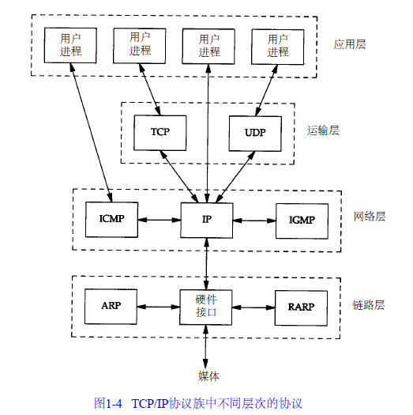
</div>


  * 链路层：常包括操作系统中的设备驱动程序和计算机中对应的网络接口卡。它们一起处理与电缆（或其他任何传输媒介）的物理接口细节。
  * 网络层：处理分组在网络中的活动，包括I P协议（网际协议），I C M P协议（I n t e r n e t互联网控制报文协议），以及I G M P协议（I n t e r n e t组管理协议）。
  * 运输层：要为两台主机上的应用程序提供端到端的通信，例如T C P（传输控制协议）和U D P（用户数据报协议）。
    * T C P为两台主机提供高可靠性的数据通信。
    * U D P则为应用层提供一种非常简单的服务。它只是把称作数据报的分组从一台主机发送到另一台主机，但并不保证该数据报能到达另一端。任何必需的可靠性必须由应用层来提供。
  * 应用层：责处理特定的应用程序细节
    * Telnet 远程登录。
    * FTP 文件传输协议。
    * SMTP 简单邮件传送协议。
    * SNMP 简单网络管理协议。

U D P数据与T C P数据基本一致。唯一的不同是U D P传给I P的信息单元称作U D P数据报（UDP datagram），而且**U D P的首部长为8字节。**
<div align=center>
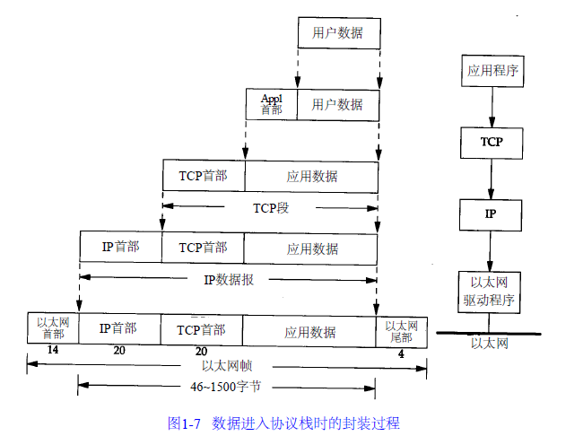
</div>

####分用
当目的主机收到一个以太网数据帧时，数据就开始从协议栈中由底向上升，同时去掉各层协议加上的报文首部。每层协议盒都要去检查报文首部中的协议标识，以确定接收数据的上层协议。
<div align=center>
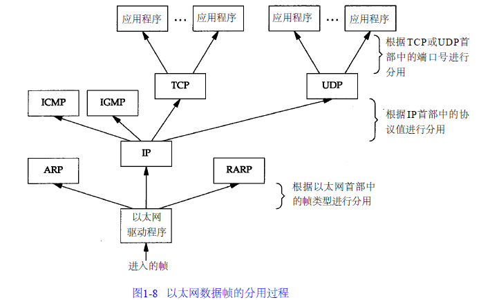
</div>


###链路层
链路层主要有三个目的：
  * 为I P模块发送和接收I P数据报
  * 为A R P模块发送A R P请求和接收A R P应答
  * 为R A R P发送R A R P请求和接收R A R P应答

####以太网
以太网这个术语一般是指数字设备公司（ Digital Equipment Corp.）、英特尔公司（ I n t e lC o r p .）和X e r o x公司在1 9 8 2年联合公布的一个标准。它是当今T C P / I P采用的主要的局域网技术。以太网I P数据报的封装是在RFC 894[Hornig 1984]中定义的，IEEE 802网络的I P数据报封装是在RFC 1042[Postel and Reynolds 1988]中定义的。最常使用的封装格式是RFC 894定义的格式。

<div align=center>

</div>

####SLIP
S L I P的全称是Serial Line IP。它是一种在串行线路上对I P数据报进行封装的简单形式。
S L I P协议定义的帧格式：
  * IP数据报以一个称作E N D（0 x c 0）的特殊字符结束。同时，为了防止数据报到来之前的线路噪声被当成数据报内容，大多数实现在数据报的开始处也传一个E N D字符（如果有线路噪声，那么E N D字符将结束这份错误的报文。这样当前的报文得以正确地传输，而前一个错误报文交给上层后，会发现其内容毫无意义而被丢弃）。
  * 如果I P报文中某个字符为E N D，那么就要连续传输两个字节0 x d b和0 x d c来取代它。0 x d b这个特殊字符被称作S L I P的E S C字符，但是它的值与A S C I I码的E S C字符（0 x 1 b）不同。
  * 如果I P报文中某个字符为S L I P的E S C字符，那么就要连续传输两个字节0 x d b和0 x d d来取代它。

<div align=center>
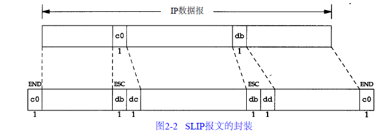
</div>

SLIP缺陷：
  * 每一端必须知道对方的I P地址。没有办法把本端的I P地址通知给另一端。
  * 数据帧中没有类型字段（类似于以太网中的类型字段）。如果一条串行线路用于S L I P，那么它不能同时使用其他协议。
  * S L I P没有在数据帧中加上检验和（类似于以太网中的C R C字段）。如果S L I P传输的报文被线路噪声影响而发生错误，只能通过上层协议来发现（另一种方法是，新型的调制解调器可以检测并纠正错误报文）

####PPP：点对点协议
P P P，点对点协议修改了S L I P协议中的所有缺陷。P P P包括以下三个部分：
  * 在串行链路上封装I P数据报的方法。P P P既支持数据为8位和无奇偶检验的异步模式（如大多数计算机上都普遍存在的串行接口），还支持面向比特的同步链接。
  * 建立、配置及测试数据链路的链路控制协议（ L C P：Link Control Protocol）
  * 针对不同网络层协议的网络控制协议（ N C P：Network Control Protocol）体系。


每一帧都以标志字符0 x 7 e开始和结束。紧接着是一个地址字节，值始终是0 x ff，然后是一个值为0 x 0 3的控制字节。
接下来是协议字段，类似于以太网中类型字段的功能
  * 0 x 0 0 2 1时，表示信息字段是一个I P数据报
  * 0 x c 0 2 1时，表示信息字段是链路控制数据
  * 0 x 8 0 2 1时，表示信息字段是网络控制数据
C R C字段（或F C S，帧检验序列）是一个循环冗余检验码，以检测数据帧中的错误。

<div align=center>
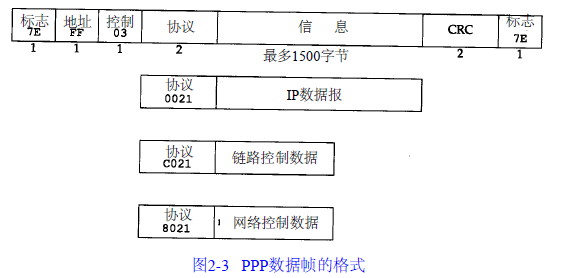
</div>

####环回接口
允许运行在同一台主机上的客户程序和服务器程序通过T C P / I P进行通信，大多数系统把I P地址1 2 7 . 0 . 0 . 1分配给这个接口，并命名为l o c a l h o s t。一个传给环回接口的I P数据报不能在任何网络上出现。大多数的产品还是照样完成传输层和网络层的所有过程，只是当I P数据报离开网络层时把它返回给自己。
<div align=center>
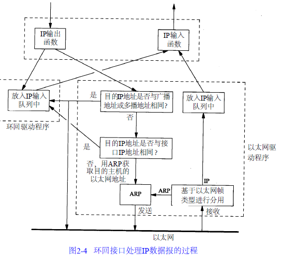
</div>

####MTU
MTU是最大传输单元。不同类型的网络大多数都有一个上限。如果I P层传输的数据的长度比链路层的M T U还大，那么I P层就需要进行分片（ f r a g m e n t a t i o n），把数据报分成若干片，这样每一片都小于M T U。
<div align=center>
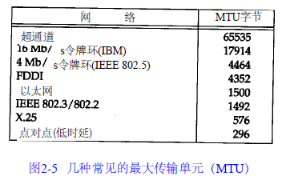
</div>


##IP
I P是T C P / I P协议族中最为核心的协议。I P提供不可靠、无连接的数据报传送服务，所有的T C P、U D P、I C M P及I G M P数据都以I P数据报格式传输。
  * 不可靠（ u n r e l i a b l e）的意思是它不能保证I P数据报能成功地到达目的地。如果发生某种错误时，I P有一个简单的错误处理算法：丢弃该数据报，然后发送I C M P消息报给信源端。任何要求的可靠性必须由上层来提供（如T C P）。
  * 无连接（ c o n n e c t i o n l e s s）这个术语的意思是I P并不维护任何关于后续数据报的状态信息。每个数据报的处理是相互独立的，这也说明，I P数据报可以不按发送顺序接收。

普通的I P首部长为2 0个字节，如下：

<div align=center>
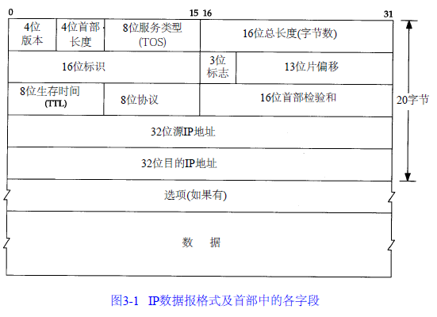
</div>


  * 4个字节的32 bit值以`big endian`字节序传输：首先是0～7 bit，其次8～15 bit，然后1 6～23 bit，最后是24~31 bit。
  * 版本：IP的版本号，版本号是4的I P有时也称作I P v 4
  * 首部长度：首部占32 bit字的数目，包括任何选项。由于它是一个4比特字段，。普通I P数据报字段的值是5。因此首部最长为6 0个字节。（已废弃）
  * 服务类型（已废弃）：
    * 3 bit的优先权子字段（现在已被忽略）
    * 4 bit的TO S子字段：分别代表最小时延、最大吞吐量、最高可靠性和最小费用
    * 1 bit未用位但必须置0
  * 总长度字段：I P数据报的长度，由于该字段长1 6比特，所以I P数据报最长可达6 5 5 3 5字节。
  * 标识字段：唯一地标识主机发送的每一份数据报。通常每发送一份报文它的值就会加1
  * TTL（time-to-live）生存时间：设置了数据报可以经过的最多路由器数，。T T L的初始值由源主机设置（通常为3 2或6 4），一旦经过一个处理它的路由器，它的值就减去1。当该字段的值为0时，数据报就被丢弃，并发送I C M P报文通知源主机。T T L字段的目的是防止数据报在选路时无休止地在网络中流动。
  * 协议字段：识别是哪个协议向I P传送数据。
    * 1表示为ICMP协议，
    * 2表示为IGMP协议，
    * 6表示为TCP协议，
    * 17表示为UDP协议。
  * 首部检验和：是根据I P首部计算的检验和码。它不对首部后面的数据进行计算。I C M P、I G M P、U D P和T C P在它们各自的首部中均含有同时覆盖首部和数据检验和码。

```
IP首部检验和的计算算法
45 00 00 2e----4表示ip版本号为ip第4版；5表示首部长度为5个32 bit字长，即为20字节；00 2e表示ip总长度为46字节，其中ip数据部分为 26字节。
be 55 00 00----be 55表示标识符；00 00表示3 bit标志及13 bit片偏移量；
7a 11 51 ac----7a表示ttl值为122；11表示协议号为17的udp协议；51 ac表示16 bit首部检验和值；
de b7 7e e3----表示32 bit 源ip地址为222.183.126.227
c0 a8 12 7a----表示32 bit 目的ip地址为192.168.18.122

检验和计算：
首先,把检验和字段置为0。
45 00 00 2e
be 55 00 00
7a 11 00 00<----检验和置为0
de b7 7e e3
c0 a8 12 7a
其次，对整个首部中的每个16 bit进行二进制反码求和，求和值为3ae50，然后3+ae50=ae53（这是根据源代码中算法 cksum = (cksum>> 16) + (cksum & 0xffff) 进行的 ）

最后，ae53+51ac=ffff。因此判断ip首部在传输过程中没有发生任何差错。

```

####IP地址
互联网上的每个接口必须有一个唯一的I n t e r n e t地址（也称作I P地址）。I P地址长32 bit。I P地址具有一定的结构。其中，主机号和网络号为全0或全1。
<div align=center>
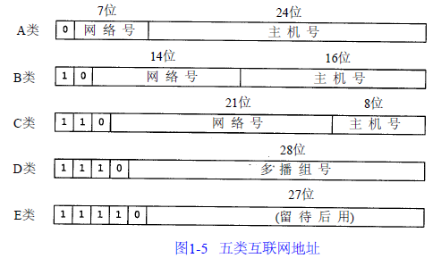
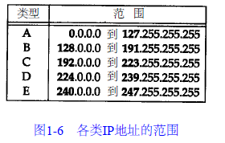
</div>


####IP路由表
I P路由选择是逐跳地（ h o p - b y - h o p）进行的。I P并不知道到达任何目的的完整路径，所有的I P路由选择只为数据报传输提供下一站路由器的I P地址，它假定下一站路由器比发送数据报的主机更接近目的，而且下一站路由器与该主机是直接相连的。
每个IP路由表包含以下信息：
  * 目的I P地址：它既可以是一个完整的主机地址，也可以是一个网络地址，由该表目中的标志字段来指定，主机地址有一个非0的主机号以指定某一特定的主机，而网络地址中的主机号为0，以指定网络中的所有主机
  * 下一站（或下一跳）路由器（ next-hop router）的I P地址，或者有直接连接的网络I P地址，下一站路由器是指一个在直接相连网络上的路由器，通过它可以转发数据报，下一站路由器不是最终的目的，但是它可以把传送给它的数据报转发到最终目的。
  * 标志，其中一个标志指明目的I P地址是网络地址还是主机地址，另一个标志指明下一站路由器是否为真正的下一站路由器，还是一个直接相连的接口。
  * 为数据报的传输指定一个网络接口。

I P路由选择主要完成以下这些功能：
  * 搜索路由表，寻找能与目的I P地址完全匹配的表目（网络号和主机号都要匹配）。如果找到，则把报文发送给该表目指定的下一站路由器或直接连接的网络接口（取决于标志字段的值）。
  * 搜索路由表，寻找能与目的网络号相匹配的表目。如果找到，则把报文发送给该表目指定的下一站路由器或直接连接的网络接口（取决于标志字段的值）。目的网络上的所有主机都可以通过这个表目来处置
  * 搜索路由表，寻找标为“默认（ d e f a u l t）”的表目。如果找到，则把报文发送给该表目指定的下一站路由器。
  * 如果上面这些步骤都没有成功，那么该数据报就不能被传送

####子网掩码
子网掩码是一个32位地址，用于屏蔽IP地址的一部分以区别网络标识和主机标识，并说明该IP地址是在局域网上，还是在远程网上，并确定有多少比特用于子网号及多少比特用于主机号，其中值为1的比特留给网络号和子网号，为0的比特留给主机号。**它必须结合 IP 地址一起使用。**第一例是子网号和主机号都是8 bit宽。第二例是一个B类地址划分成10 bit的子网号和6 bit的主机号。

<div align=center>
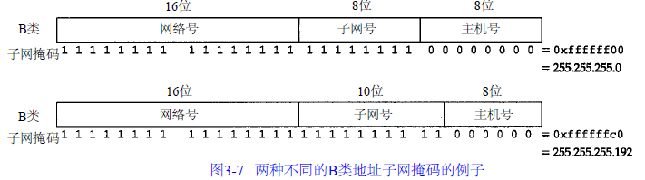
</div>

给定I P地址和子网掩码以后，主机就可以确定I P数据报的目的地：
  * 本子网上的主机（网络号和子网号相同）
  * 本网络中其他子网中的主机（网络号相同，子网号不同）
  * 其他网络上的主机（网络号和子网号均不同）

##ARP
####ARP
ARP（Address Resolution Protocol）即地址解析协议， 用于实现从 IP 地址到 MAC 地址的映射，即询问目标IP对应的MAC地址。
网络接口有一个硬件地址（一个48 bit的值，标识不同的以太网或令牌环网络接口）。在硬件层次上进行的数据帧交换必须有正确的接口地址。但是，T C P / I P有自己的地址： 32 bit的I P地址。知道主机的I P地址并不能让内核发送一帧数据给主机。**当一台主机把以太网数据帧发送到位于同一局域网上的另一台主机时，是根据48 bit的以太网地址来确定目的接口的**，内核（如以太网驱动程序）必须知道目的端的硬件地址才能发送数据，设备驱动程序从不检查I P数据报中的目的I P地址。


####ARP原理
A R P发送一份称作A R P请求的以太网数据帧给以太网上的每个主机。这个过程称作**广播**，目的主机的A R P层收到这份广播报文后，识别出这是发送端在寻问它的I P地址，于是发送一个A R P应答。这个A R P应答包含I P地址及对应的硬件地址。即可取到特定IP对应的MAC地址，然后存储到本地ARP缓存表，后续需要的话，就到这里查找。

<div align=center>
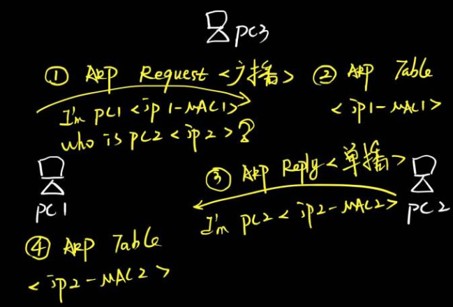
</div>

A R P高效运行的关键是由于每个主机上都有一个A R P高速缓存。这个高速缓存存放了最近I n t e r n e t地址到硬件地址之间的映射记录。高速缓存中每一项的生存时间一般为2 0分钟，起始时间从被创建时开始算起。

####ARP格式
<div align=center>

</div>

  * 以太网报头中的前两个字段是以太网的源地址和目的地址。目的地址为全1的特殊地址是广播地址。电缆上的所有以太网接口都要接收广播的数据帧。
  * 帧类型表示后面数据的类型，ARP该字段的值为0x0806。RARP该字段的值为0x8035。
  * 硬件类型字段表示硬件地址的类型。它的值为1即表示以太网地址。
  * 协议类型字段表示要映射的协议地址类型。它的值为0 x 0 8 0 0即表示I P地址。它的值与包含I P数据报的以太网数据帧中的类型字段的值相同。
  * 硬件地址长度和协议地址长度分别指出硬件地址和协议地址的长度，以字节为单位。对于以太网上I P地址的A R P请求或应答来说，它们的值分别为6和4。
  * 操作字段指出四种操作类型，它们是A R P请求（值为1）、A R P应答（值为2）、R A R P请求（值为3）和R A R P应答（值为4）。这个字段必需的，因为A R P请求和A R P应答的帧类型字段值是相同的。

对于一个A R P请求来说，除目的端硬件地址外的所有其他的字段都有填充值。当系统收到一份目的端为本机的A R P请求报文后，它就把硬件地址填进去，然后用两个目的端地址分别替换两个发送端地址，并把操作字段置为2，最后把它发送回去。

####ARP代理
如果ARP请求是从一个网络的主机发往另一个网络上的主机，那么连接这两个网络的路由器就可以回答该请求，这个过程称作委托ARP或ARP代理(Proxy ARP)。当ARP请求目标跨网段时，网关设备收到此ARP请求，会用自己的MAC地址返回给请求者。


<div align=center>
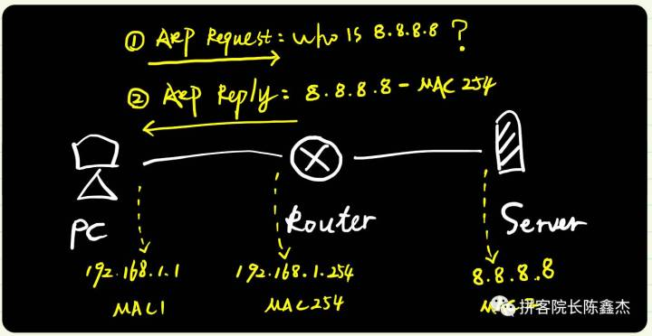
</div>

实际网络中，代理ARP由网络中的网关设备来执行，包括路由器、多层交换机、无线路由器、防火墙等设备。并且，网关即便有代理ARP功能，也未必一定执行，还必须满足两个条件：
  * ①网关已经开启代理ARP功能；
  * ②网关有目标的路由信息。

当网络通信采用代理ARP时，可能会"受制于沿途网关设备"，造成网络通信故障。实际网络中，无论是同网段还是跨网段通信（例如访问互联网），绝大情况下都是使用正常的ARP，而不是代理ARP。

####免费ARP
主机发送A R P查找自己的I P地址。
主要有两方面作用：
  * 一个主机可以通过它来确定另一个主机是否设置了相同的I P地址。
  * 如果发送免费A R P的主机正好改变了硬件地址（很可能是主机关机了，并换了一块接口卡，然后重新启动），那么这个分组就可以使其他主机高速缓存中旧的硬件地址进行相应的更新。

<div align=center>
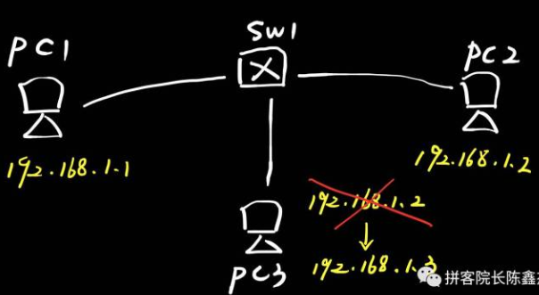
</div>

<div align=center>
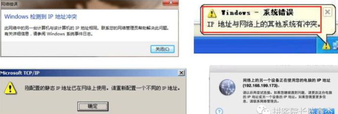
</div>


####RARP（逝去的协议）
R A R P协议是许多无盘系统在引导时用来获取I P地址的。R A R P分组格式基本上与A R P分组一致。一个R A R P请求在网络上进行广播，它在分组中标明发送端的硬件地址，以请求相应I P地址的响应。应答通常是单播传送的。

##ICMP
ICMP是(Internet Control Message Protocol)Internet控制报文协议。它是TCP/IP协议族的一个子协议，用于在IP主机、路由器之间传递控制消息。控制消息是指网络通不通、主机是否可达、路由是否可用等网络本身的消息。这些控制消息虽然并不传输用户数据，但是对于用户数据的传递起着重要的作用。它传递差错报文以及其他需要注意的信息。I C M P报文通常被I P层或更高层协议（ T C P或U D P）使用。一些I C M P报文把差错报文返回给用户进程。I C M P报文是在I P数据报内部被传输的。
<div align=center>
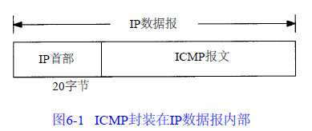
</div>

所有报文的前4个字节都是一样的，但是剩下的其他字节则互不相同。不同类型由报文中的类型字段和代码字段来共同决定。
  * 类型字段可以有1 5个不同的值，以描述特定类型的I C M P报文。某些I C M P报文还使用代码字段的值来进一步描述不同的条件。
  * 检验和字段覆盖整个I C M P报文。使用的算法与I P首部检验和算法相同。I C M P的检验和是必需的。

<div align=center>
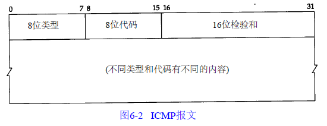
</div>

当发送一份I C M P差错报文时，报文始终包含I P的首部和产生I C M P差错报文的I P数据报的前8个字节，接收I C M P差错报文的模块就会把它与某个特定的协议部中的协议（根据I P数据报首字段来判断）和用户进程（根据包含在I P数据报前8个字节中的T C P或U D P报文首部中的T C P或U D P端口号来判断）联系起来.
下面各种情况都不会导致产生I C M P差错报文：
  * ICMP差错报文（但是，I C M P查询报文可能会产生I C M P差错报文）。
  * 目的地址是广播地址或多播地址的I P数据报。
  * 作为链路层广播的数据报。
  * 不是I P分片的第一片
  * 源地址不是单个主机的数据报。这就是说，源地址不能为零地址、环回地址、广播地址或多播地址。

<div align=center>
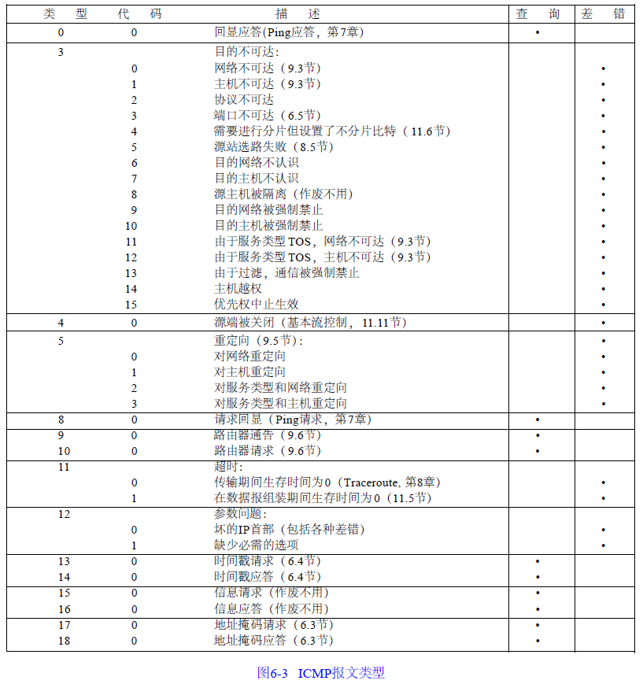
</div>

####ICMP地址掩码
I C M P地址掩码请求用于无盘系统在引导过程中获取自己的子网掩码，系统广播它的I C M P请求报文（这一过程与无盘系统在引导过程中用R A R P获取I P地址是类似的）。
  * I C M P报文中的标识符和序列号字段由发送端任意选择设定，这些值在应答中将被返回。这样，发送端就可以把应答与请求进行匹配。

<div align=center>
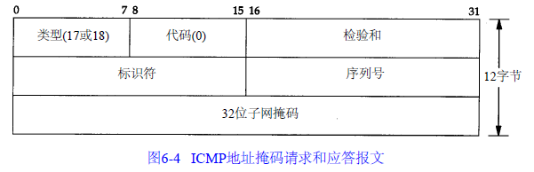
</div>

####ICMP时间戳请求

I C M P时间戳请求允许系统向另一个系统查询当前的时间，返回的建议值是自午夜开始计算的毫秒数。它提供了毫秒级的分辨率，由于返回的时间是从午夜开始计算的，因此调用者必须通过其他方法获知当时的日期。

<div align=center>
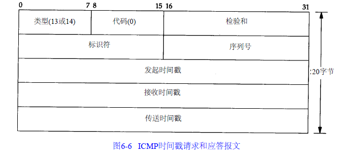
</div>

####ICMP端口不可达
如果收到一份U D P数据报而目的端口与某个正在使用的进程不相符，那么U D P返回一个I C M P不可达报文。可以用T F T P来强制生成一个端口不可达报文。

<div align=center>
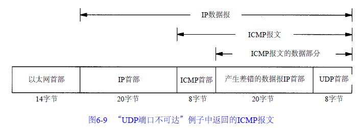
</div>

<div align=center>
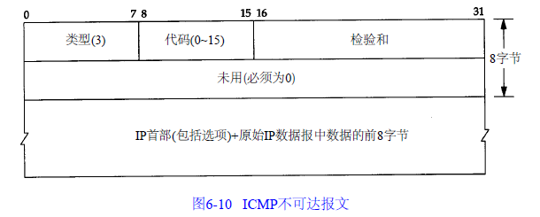
</div>

####PING
p i n g程序是对两个T C P / I P系统连通性进行测试的基本工具。它只利用I C M P回显请求和回显应答报文，而不用经过传输层（ T C P / U D P）。P i n g服务器一般在内核中实现I C M P的功能。我们称发送回显请求的p i n g程序为客户，而称被p i n g的主机为服务器。服务器必须响应标识符和序列号字段。另外，客户发送的选项数据必须回显，假设客户对这些信息都会感兴趣。
p i n g程序通过在I C M P报文数据中存放发送请求的时间值来计算往返时间。当应答返回时，用当前时间减去存放在I C M P报文中的时间值，即是往返时间。
<div align=center>
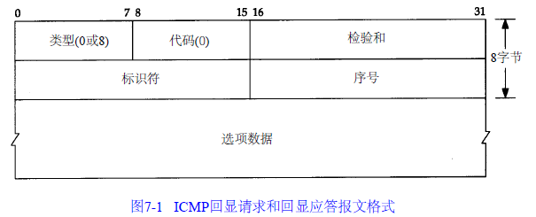
</div>

####Traceroute
 命令利用ICMP 协议定位您的计算机和目标计算机之间的所有路由器。使用I C M P报文和I P首部中的T T L字段（生存周期）。T T L字段是由发送端初始设置一个8 bit字段。每个处理数据报的路由器都需要把T T L的值减1或减去数据报在路由器中停留的秒数。由于大多数的路由器转发数据报的时延都小于1秒钟，因此T T L最终成为一个跳站的计数器，所经过的每个路由器都将其值减1。
工作流程：
  * 它发送一份T T L字段为1的I P数据报给目的主机。处理这份数据报的第一个路由器将T T L值减1，丢弃该数据报，并发回一份超时I C M P报文。这样就得到了该路径中的第一个路由器的地址。
  * 发送一份T T L值为2的数据报，这样我们就可以得到第二个路由器的地址。
  * 继续这个过程直至该数据报到达目的主机。但是目的主机哪怕接收到T T L值为1的I P数据报，也不会丢弃该数据报并产生一份超时I C M P报文，这是因为数据报已经到达其最终目的地。
  * Tr a c e r o u t e程序发送一份U D P数据报给目的主机，但它选择一个不可能的值作为U D P端口号（大于30 000），使目的主机的任何一个应用程序都不可能使用该端口。将使目的主机的U D P模块产生一份“端口不可达”错误的I C M P报文。

####IP选路
对于一个给定的路由器，可以打印出五种不同的标志（ f l a g）：
  * U：该路由可以使用。
  * G：该路由是到一个网关（路由器）。如果没有设置该标志，说明目的地是直接相连的。（发往直接路由的分组中不但具有指明目的端的I P地址，还具有其链路层地址。当分组被发往一个间接路由时， I P地址指明的是最终的目的地，但是链路层地址指明的是网关（即下一站路由器））
  * H：该路由是到一个主机，也就是说，目的地址是一个完整的主机地址。如果没有设置该标志，说明该路由是到一个网络，而目的地址是一个网络地址：一个网络号，或者网络号与子网号的组合。
  * D：该路由是由重定向报文创建的
  * M：该路由已被重定向报文修改

####ICMP重定向差错
  当I P数据报应该被发送到另一个路由器时，收到数据报的路由器就要发送I C M P重定向差错报文给I P数据报的发送端。只有当主机可以选择路由器发送分组的情况下，我们才可能看到I C M P重定向报文。
  * 主机发送一份I P数据报给R 1。R 1是该主机的默认路由。
  * R1收到数据报并且检查它的路由表，发现R 2是发送该数据报的下一站。当它把数据报发送给R 2时，R 1检测到它正在发送的接口与数据报到达接口是相同的（即主机和两个路由器所在的L A N）
  * R1 发送一份I C M P重定向报文给主机，告诉它以后把数据报发送给R 2而不是R 1。

<div align=center>
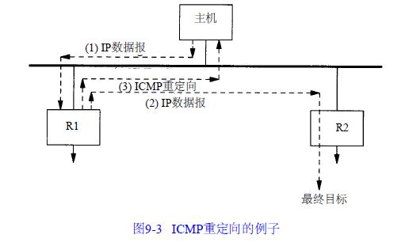
</div>

重定向报文只能由路由器生成，而不能由主机生成。重定向报文是为主机而不是为路由器使用的。假定路由器和其他一些路由器共同参与某一种选路协议，则该协议就能消除重定向的需要。I C M P重定向报文的接收者必须查看三个I P地址：
  * 导致重定向的IP地址（即I C M P重定向报文的数据位于I P数据报的首部）
  * 发送重定向报文的路由器的I P地址（包含重定向信息的I P数据报中的源地址）
  * 应该采用的路由器I P地址

<div align=center>
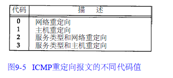
</div>


<div align=center>
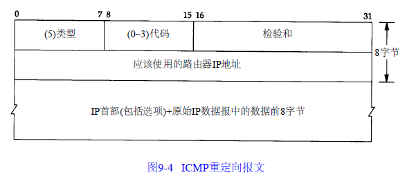
</div>

####ICMP路由器请求/通告

<div align=center>
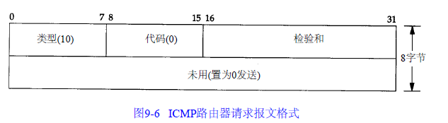
</div>

<div align=center>
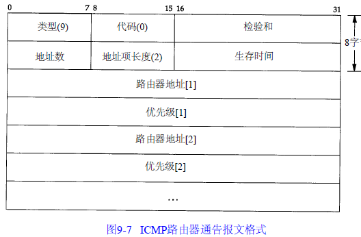
</div>