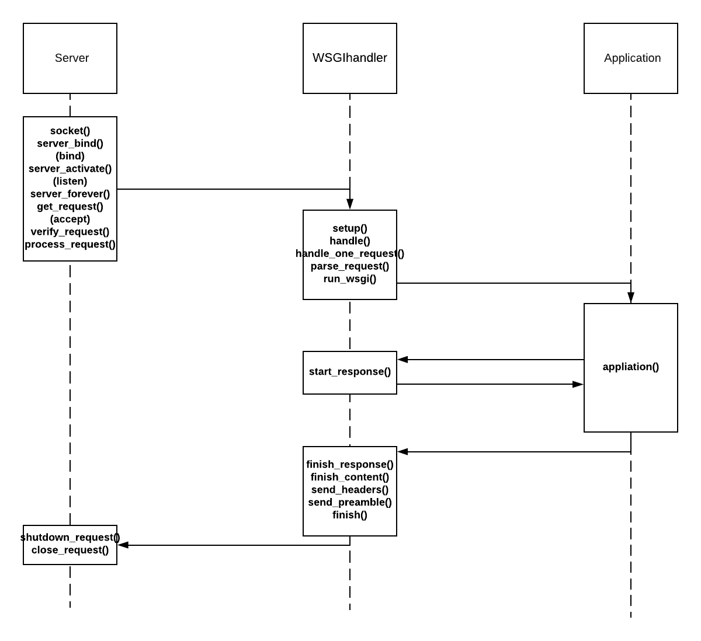
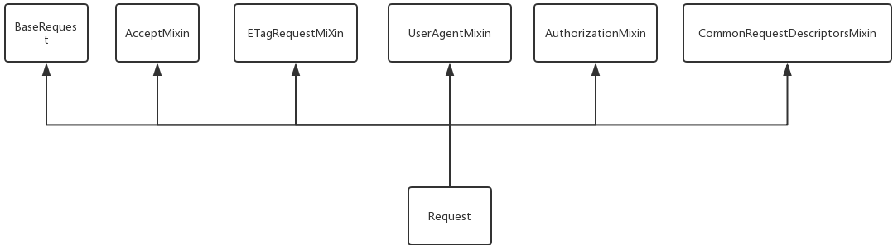
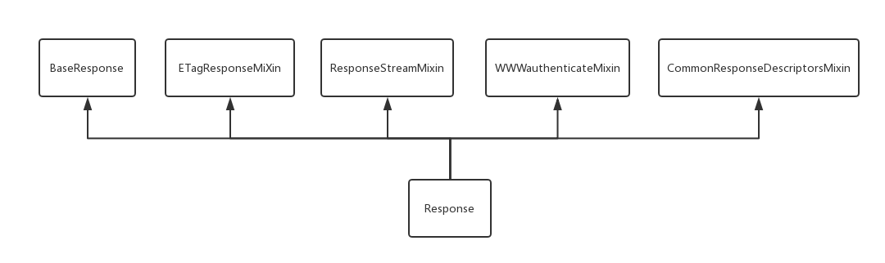
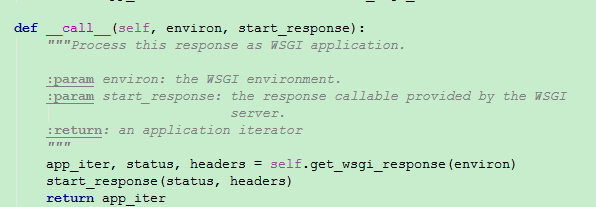

#WSGI

>WSGI(Web Server Gateway Interface)是一种规范，描述web server如何与web application通信的规范。要实现WSGI协议，必须同时实现web server和web application，当前运行在WSGI协议之上的web框架有Torando,Flask,Django。

WSGI协议主要包括server和application两部分：

  * WSGI server负责从客户端接收请求，将request转发给application，将application返回的response返回给客户端；

  * WSGI application接收由server转发的request，处理请求，并将处理结果返回给server。application中可以包括多个栈式的中间件(middlewares)，这些中间件需要同时实现server与application，因此可以在WSGI服务器与WSGI应用之间起调节作用：对服务器来说，中间件扮演应用程序，对应用程序来说，中间件扮演服务器。

WSGI协议其实是定义了一种server与application解耦的规范，即可以有多个实现WSGI server的服务器，也可以有多个实现WSGI application的框架，那么就可以选择任意的server和application组合实现自己的web应用。例如uWSGI和Gunicorn都是实现了WSGI server协议的服务器，Django，Flask是实现了WSGI application协议的web框架，可以根据项目实际情况搭配使用。

对于WSGI应用，要求实现一个可调用对象`app(environ, start_response)`。WSGI服务器中会定义`start_response()`函数并且调用WSGI应用。

####流程图

####Request

  * `BaseRequest` ——基础的请求类.
  * `AcceptMixin` ——请求报文中关于客户端希望接收的数据类型的类。
  * `ETagRequestMixin` ——请求报文中关于Etag和Cache的类。
  * `UserAgentMixin` ——请求报文中关于user_agent的类。
  * `AuthorizationMixin` ——请求报文中关于认证的类。
  * `CommonRequestDescriptorsMixin` ——通过这个类可以获取请求首部中的相关信息。

`BaseRequest`只要传递一个`WSGI`环境变量作为参数，便可以构造一个`BaseRequest`实例。所有的`BaseRequest`属性只能以**只读**的方式访问。比较常用的方法：
  * `from_values(cls, *args, kwargs)`：可以根据参数构造要给请求
  * `application(cls, f)`：一个装饰器，可以用来装饰`WSGI`可调用对象或函数。

####Response

  * `BaseResponse` ——基础响应类
  * `ETagResponseMixin` ——为响应增加Etag和Cache控制的类。
  * `ResponseStreamMixin` ——为响应可迭代对象提供一个“只写”的接口的类。
  * `CommonResponseDescriptorsMixin` ——通过这个类可以获取响应首部中的相关信息。
  * `WWWAuthenticateMixin` ——为响应提供认证的类。

`BaseResponse`**是一个`WSGI`应用**。

